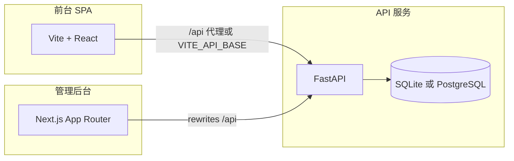

# AI 工具导航站 — 架构与程序说明

## 1. 产品定位

面向最终用户的 **AI 工具发现、分类浏览、详情与对比**，以及 **登录用户提交工具、收藏与个人页**；管理端提供 **工具审核、用户与评论治理、流量看板、商业化订单、首页搜索联想词与系统设置**等。

## 2. 技术架构（三端）

- **前台**（`frontend/`）：Vite 5 + React 19 + React Router；Tailwind；`src/lib/api.ts` 统一请求。
- **后台管理**（`admin/`）：Next.js 14；Zustand 持久化管理员 token；`lib/admin-api.ts` 调用同源 `/api`。
- **服务端**（`backend/`）：FastAPI；默认 **SQLite**（`data/app.db`），可选 **`DATABASE_URL`** 使用 **PostgreSQL**；JWT + bcrypt；启动时 `init_db`、种子、演示账号。

## 3. 目录与职责

| 路径 | 职责 |
|------|------|
| `backend/app/main.py` | 应用工厂、CORS、路由挂载、**lifespan** 启动链（建库/种子/演示账号） |
| `backend/app/db.py` | 连接 DB（SQLite 或 PG）、建表/迁移入口 |
| `backend/app/db_util.py` | PG 适配与 SQL 方言辅助 |
| `backend/app/security.py` | JWT 签发与密码哈希 |
| `backend/app/deps_auth.py` | `get_current_admin` / `get_optional_user_id` |
| `backend/app/analytics_service.py` | 管理端大盘与页面统计 SQL |
| `backend/app/routers/*.py` | 各领域 HTTP 接口（见 API 清单） |
| `frontend/src/app/App.tsx` | 根布局与路由出口 |
| `frontend/src/app/routes.tsx` | 页面路由表 |
| `frontend/src/app/contexts/*` | 语言、登录态 |
| `frontend/src/app/hooks/usePageTracking.ts` | PV/停留埋点 |
| `admin/app/admin/*` | 各后台页面 |
| `admin/components/*` | 侧边栏（读 `admin_settings.admin_menu_items`）、图表、弹窗等 |

`frontend/src/app/components/ui/*` 为基于 shadcn 风格的通用 UI（**现 14 个文件**：按钮、表单控件、对话框、标签页等）；**BACKLOG-A** 已闭见 [05-工程优化与运维备忘.md](./05-工程优化与运维备忘.md)。

## 4. 数据流要点

1. **首页**：并行请求 `/api/tools`、`/api/categories`、`/api/search-suggestions`、`/api/site/home_seo`、`/api/site/ui_toasts`（见 `useHomeData.ts`）。**搜索联想词**数据来自表 **`search_suggestion`**，管理端在 **`/admin/search-suggestions`** 维护（见 **`/api/admin/search-suggestions*`**）。**顶栏品牌**由 `Navigation` 读 **`home_seo`**（**`brand_title` / `brand_icon_emoji`** 等），管理端优先 **「首页 SEO」**（`/admin/home-seo`），缺省标题 `AI Tools Hub`。
2. **工具详情**：`/api/tools/{slug}/detail?locale=`；404 时可读 `/api/site/not_found` 展示文案。
3. **登录/注册**：写入 `localStorage` 的 `user` 与 `access_token`；首屏挂载时用 **`GET /api/me`** 校验 JWT，**401 则清空**用户快照与 token（避免过期 token「假登录」）。个人展示字段持久化见 **`PUT /api/me/profile`**（与 `AuthContext.refreshUser`）。个人中心 **活动与统计**登录态下优先 **`GET /api/me/activity`**，与 **`/api/site/profile`** 中 **UI 文案**合并展示。
4. **提交工具**：必须带 JWT，`sub` 写入 `tool.submitted_by_user_id`。
5. **管理员**：登录接口与普通用户相同，前端校验 `role === "admin"` 后写入仅后台使用的 token store。

## 5. 环境变量一览

| 变量 | 位置 | 含义 |
|------|------|------|
| `ENVIRONMENT` | 后端 | 设为 **`production`** 时启用 **`JWT_SECRET` 强校验**，且演示账号逻辑不覆盖已有用户密码（见 `env_guard` / `ensure_accounts`） |
| `JWT_SECRET` | 后端 | JWT 签名密钥 |
| `DATABASE_URL` | 后端 | （可选）PostgreSQL 连接串；未设则用 SQLite |
| `ALLOWED_ORIGINS` | 后端 | CORS 允许源，逗号分隔；见 `main.py` |
| `PUBLIC_SITE_URL` | 后端 | 公网站点根（sitemap/robots 等），见 `01-部署指南.md` |
| `VITE_API_BASE` | 前台构建 | 生产 API 根 URL |
| `VITE_PUBLIC_SITE_URL` | 前台构建 | 浏览器端 canonical/OG 根 URL |
| `DEV_API_PROXY` | 前台开发 | Vite 代理后端地址 |
| `API_PROXY_TARGET` | 管理端构建/启动 | Next rewrites 目标 |

各目录提供 `.env.example`。

## 6. 与《源代码文件索引》的关系

业务与联调相关文件在 `docs/07-源代码文件索引.md` 中按文件逐段解释；通用 UI 组件仅列表索引，避免重复。

## 7. 待办与验收

跨文档的**未关闭事项汇总**（安全、部署、测试执行、SEO 缺口等）见 [**03-开放事项总表.md**](./03-开放事项总表.md)（**§0** 为自 `01`～`10` 文档整理的待处理清单速览，**§1** 为一览表）；上线勾选模板见 [**09-上线发布验收清单.md**](./09-上线发布验收清单.md)。
