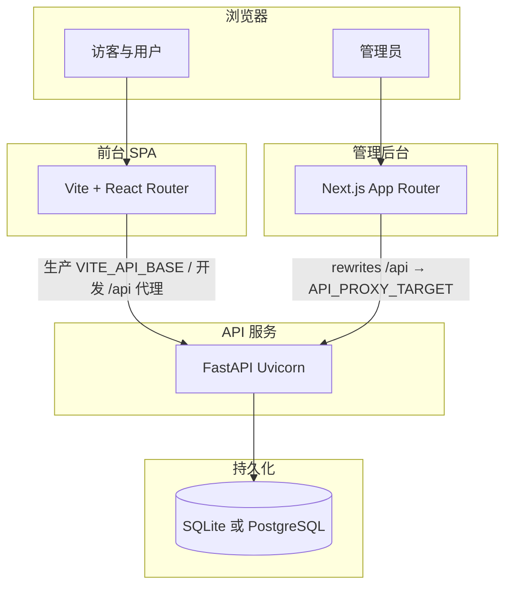

# 程序说明书（完整）

本文描述 **AI 工具导航站** 当前仓库的**程序结构、运行时行为、数据模型概览、接口分层与三端职责**，作为开发与运维的**单一入口说明**。路径、方法、请求体等**以 [06-API接口参考.md](./06-API接口参考.md) 为权威细表**；文件级索引见 [07-源代码文件索引.md](./07-源代码文件索引.md)。

---

## 1. 文档范围与读者

- **范围**：`backend/app/`、`frontend/src/`、`admin/app/` 等自研源码及 `backend/sql/` 模式；不含 `node_modules`、虚拟环境、构建产物。
- **读者**：后端/前端/管理端开发、运维、测试、技术产品（需理解能力边界时）。

---

## 2. 系统上下文

---

## 3. 技术栈与仓库目录

| 部分 | 技术 | 根目录 |
|------|------|--------|
| API | Python 3.10+、FastAPI、Uvicorn、PyJWT、passlib/bcrypt；可选 psycopg | `backend/` |
| 前台 | React 19、Vite 5、React Router、Tailwind、shadcn 风格 UI | `frontend/` |
| 管理端 | Next.js 14、Zustand（token 持久化） | `admin/` |
| 模式 | SQLite `schema.sql`、PostgreSQL `schema.pg.sql` | `backend/sql/` |
| 种子 | 空库导入业务与站点 JSON | `backend/data/seed/` |

---

## 4. 应用入口与生命周期（后端）

### 4.1 工厂与全局实例

- **`backend/app/main.py`**：`create_app()` 组装 **CORS**、注册全部 **`APIRouter`**（统一前缀 **`/api`**），并导出模块级 **`app`** 供 Uvicorn 加载。
- **OpenAPI 版本**：与 **`release_meta.api_version()`** 一致（环境变量 **`APP_VERSION`** 可覆盖，默认 `1.0.0`）。

### 4.2 Lifespan 启动链（顺序敏感）

1. **`enforce_production_secrets()`**（`env_guard`）：`ENVIRONMENT=production` 且 `JWT_SECRET` 弱/占位 → **进程退出**。
2. **`warn_production_cors_origins()`**：生产未设 `ALLOWED_ORIGINS` 或为 `*` → **stderr WARN**，不退出。
3. **`init_db()`**：建表 + 执行 **`migrate.py`** 中登记的增量迁移。
4. **`run_seed_if_empty()`**：仅当库为空时导入种子数据。
5. **`ensure_dev_accounts()`**：保证演示管理员与普通用户存在；**生产**对已存在用户**不覆盖** `password_hash`。
6. **`seed_monetization_sample(conn)`**：订单表为空时插入示例推广订单（需存在 demo 用户与 active 工具）。
7. **`asyncio.create_task(crawler_scheduler_loop())`**：进程内约每分钟巡检 **定时爬虫**；停机时 cancel 并 `await` 收尾。

### 4.3 CORS 策略（摘要）

- 环境变量 **`ALLOWED_ORIGINS`**：逗号分隔完整 Origin；**`*`** 时 `allow_credentials=false`。
- **未设置**：`allow_origins=[]`，依赖 **`allow_origin_regex`** 匹配本机与常见 **RFC1918 私网** Origin，便于局域网联调；**公网前端跨域须显式配置白名单**。

---

## 5. 数据库与迁移

### 5.1 连接与方言

- **`backend/app/db.py`**：默认 SQLite 文件路径由 **`paths.py`** 解析；若设置 **`DATABASE_URL`**（`postgresql://` / `postgres://`）则使用 **PostgreSQL** 与 **`db_util.PgConnectionAdapter`**。
- **`backend/app/db_util.py`**：占位符、DDL 分句、Row 形态等 PG 适配。

### 5.2 表清单（逻辑模型）

以下表定义见 **`backend/sql/schema.sql`**（及 PG 对应脚本）：

| 表 | 用途 |
|----|------|
| `category` | 工具分类 |
| `tool` | 工具主实体（审核状态、slug、提交者等） |
| `tool_feature` / `tool_screenshot` / `tool_pricing_plan` | 详情子资源 |
| `tool_alternative` | 替代工具关系 |
| `review` | 用户评论（UGC 状态） |
| `search_suggestion` | 首页搜索联想词 |
| `translation` | i18n 键值 |
| `comparison_page` | 对比落地页 JSON |
| `site_json` | 键值型站点大块配置（含 `page_seo`、`admin_settings`、各类 UI 块等） |
| `locale_meta` | 语言列表元数据 |
| `app_user` | 用户与角色、封禁、展示字段 |
| `user_favorite` | 收藏 |
| `page_view_log` / `page_analytics_daily` | 埋点原始与按日聚合 |
| `monetization_order` | 推广订单 |
| `ai_insight_*` | AI SEO 提示词、模型连接、运行记录 |
| `crawler_source` / `crawler_job` / `crawler_job_preview` | 内容爬虫数据源与任务 |

### 5.3 迁移

- **`backend/app/migrate.py`**：版本化增量 SQL；由 **`init_db`** 在启动时应用。发布含迁移版本时须按 [16](./16-部署与发布完整说明书.md) 执行备份与预发验证。

---

## 6. HTTP API 分层（路由注册顺序与职责）

**统一前缀**：`/api`（健康检查亦为 **`GET /api/health`**）。

| 分组 | 模块文件 | 职责摘要 |
|------|----------|----------|
| 健康 | `health_release.py` | `GET /health`：存活、版本、`database_backend`、可选 build 元数据 |
| 工具与目录 | `tools.py`、`catalog.py` | 列表、详情（含 **`promotion_active`**）、分类、搜索建议、提交选项 |
| 站点块 | `site.py` | `GET /site/{key}`、`/dashboard-data` |
| SEO 公开 | `seo_public.py` | `sitemap.xml`、`robots.txt` |
| 国际化 | `i18n.py` | 文案 bundle、语言列表 |
| 对比 | `comparisons.py` | 对比页 JSON（含弱曝光字段） |
| 认证 | `auth.py` | 登录、注册 |
| 当前用户 | `user_profile.py`、`user_settings.py`、`user_favorites.py`、`user_activity.py`、`user_orders.py` | `/me*` 系列 |
| 埋点 | `track.py` | `POST /track`，Cookie `track_sid` |
| 投稿 | `submissions.py` | 登录用户提交工具 |
| 管理端 | `admin_*.py` | 大盘、分析、工具审核、用户、评论、订单、设置、站点 JSON、翻译、联想词、对比页、爬虫、**AI SEO** 等 |

**管理员鉴权**：依赖 **`deps_auth.get_current_admin`**，JWT 内 **`role=admin`**。

**详表**（方法、路径、请求体、错误码）：**[18-REST-API完整接口文档.md](./18-REST-API完整接口文档.md)**（全量）；日常精简查阅 **[06-API接口参考.md](./06-API接口参考.md)**。

---

## 7. 核心业务规则（节选）

### 7.1 工具上架

- 公开列表与详情仅 **`moderation_status=active`**（具体字段以 `tools` 路由查询为准）。

### 7.2 推广弱曝光

- **`backend/app/promotion_util.py`**：某 `tool_id` 存在 **`payment_status=paid`** 且当日在 **`valid_from`～`valid_until`** 内则视为推广中。
- **详情接口**返回 **`promotion_active`**；**对比页**通过工具**展示名**与 `tool.name` 匹配后再打标（名不一致则无标）。决策见 [10](./10-需求-商业化与订单.md) §6。

### 7.3 AI SEO 助手

- 只读组装站点与流量快照，调用 **OpenAI 兼容** `chat/completions`；结果入库为历史记录，**不自动写** `site_json` 或工具表。见 [12](./12-需求-AI-SEO与流量分析助手.md)。

### 7.4 内容爬虫

- 管理端配置 **`crawler_source`**，任务写 **`crawler_job`**；可预览后提交，默认写入 **`tool` 为 `pending`**。定时由 **`crawler_scheduler`** 驱动，可用 **`CRAWLER_SCHEDULER_ENABLED`** 关闭。见 [13](./13-需求-内容爬虫与后台操作.md)。

---

## 8. 前台应用（`frontend/`）

### 8.1 构建与运行时配置

- **`src/lib/api.ts`**：解析 **`VITE_API_BASE`**（生产）或开发代理/可选 **`VITE_DEV_API_BASE`**。
- **`src/lib/siteUrl.ts`**：**`VITE_PUBLIC_SITE_URL`** 与 canonical/OG 根。

### 8.2 路由

- **`src/app/routes.tsx`**：`createBrowserRouter`，主要路径包括 `/`、`/tool/:id`（slug）、`/compare`、`/compare/:toolName`、`/dashboard`、`/profile`、`/orders/:orderId`、`/favorites`、`/settings`、`/submit`、`/sitemap`、`/guide`、`/more`、`/support/*`、404。
- **`TrackingLayout`**：路由变化时上报 **`POST /api/track`**。

### 8.3 状态与国际化

- **`AuthContext`**：`localStorage` 中 `user` 与 `access_token`；挂载 **`GET /api/me`** 校验 JWT，401 则清空。
- **`LanguageContext`**：拉取 **`/api/i18n/{locale}`** 等。

### 8.4 SEO 组件

- **`SEO.tsx`**、**`useResolvedPageSeo`**：与 **`/api/site/page_seo`** 及管理端 **Page SEO** 配置对齐（见 [08](./08-管理后台与SEO控制面.md)）。

---

## 9. 管理端应用（`admin/`）

### 9.1 API 代理

- **`next.config.mjs`**：将 **`/api/*`** rewrite 到 **`API_PROXY_TARGET`**（默认 `http://127.0.0.1:8000`）。

### 9.2 主要页面路径（App Router）

- **`/login`**：非 admin 拒绝进入后台。
- **`/admin/*`**：`dashboard`、`analytics`、`tools`、`tools/[id]/edit`、`users`、`reviews`、`monetization`、`page-seo`、`tool-json-ld`、`site-blocks`、`search-suggestions`、`site-submit`、`site-dashboard`、`home-seo`、`translations`、`comparisons`、`settings`、`ai-seo-insights`（及 **`runs/[id]`**）、**`crawler`** 等。
- 侧栏菜单：优先 **`GET /api/admin/settings`** 中 `admin_menu_items`，失败或无数据时用内置 fallback。

---

## 10. 安全与鉴权

- **密码**：bcrypt（版本约束见 `requirements.txt`）。
- **JWT**：签发与校验在 **`security.py`**；依赖头 **`Authorization: Bearer`**。
- **生产**：**`ENVIRONMENT=production` + 强 `JWT_SECRET`**；CORS 白名单与 HTTPS 由部署层保证（见 [16](./16-部署与发布完整说明书.md)、[04](./04-P0安全与联调备忘.md)）。

---

## 11. 脚本与自动化

| 脚本 / 工作流 | 用途 |
|-----------------|------|
| `backend/scripts/publish_smoke.sh` | 对 `BASE_URL` 做公开接口抽样（401/200） |
| `backend/scripts/crawler_acceptance.py` | 爬虫能力验收（临时库，见 [06](./06-API接口参考.md)） |
| `.github/workflows/ci.yml` | 三端 build + smoke |

---

## 12. 与细分文档的映射

| 主题 | 文档 |
|------|------|
| 架构精要、环境变量表 | [02-架构与程序说明.md](./02-架构与程序说明.md) |
| REST 全清单 | [06-API接口参考.md](./06-API接口参考.md) |
| 源文件职责 | [07-源代码文件索引.md](./07-源代码文件索引.md) |
| 后台 ↔ 前台 SEO 控制矩阵 | [08-管理后台与SEO控制面.md](./08-管理后台与SEO控制面.md) |
| 待办与 BACKLOG | [03](./03-开放事项总表.md)、[11](./11-控制面演进需求-CP-BACKLOG.md) |
| 商业化、AI SEO、爬虫需求 | [10](./10-需求-商业化与订单.md)、[12](./12-需求-AI-SEO与流量分析助手.md)、[13](./13-需求-内容爬虫与后台操作.md) |
| 部署与发布 SOP | [16-部署与发布完整说明书.md](./16-部署与发布完整说明书.md) |
| 产品商业综合评估 | [15-产品市场商业与程序综合评估梗概.md](./15-产品市场商业与程序综合评估梗概.md) |

---

## 13. 版本与维护

- **程序版本号**：以后端 **`APP_VERSION`** / OpenAPI / **`GET /api/health`** 的 `api_version` 为准。
- **本文**：随仓库大功能变更更新；接口细节变更请同步 **[06](./06-API接口参考.md)**，避免双处冗长复制。

---

*本文档为「程序说明书」完整版；若与代码不一致，以代码与 [06](./06-API接口参考.md) 为准并应修正本文。*
