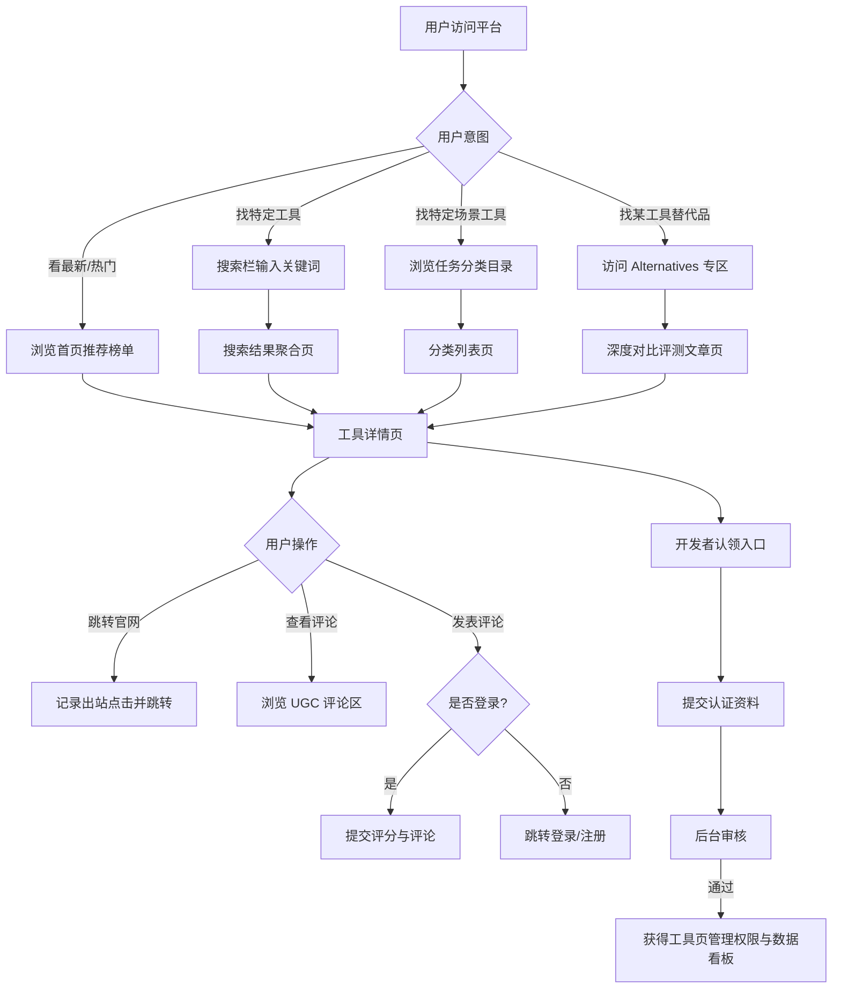

# 产品需求文档 (PRD) - 新一代 AI 工具导航与评测平台

**作者**: Manus AI
**日期**: 2026年3月30日

## 前言

本产品需求文档（PRD）旨在基于对 There's An AI For That (TAAFT) 的深度竞品分析 [1] 和《深度运营需求文档 (ORD)》 [2] 的洞察，详细定义一个新一代 AI 工具导航与评测平台的产品功能、用户体验及技术实现需求。文档将重点关注如何通过全链路 SEO 矩阵、高粘性社区生态和多元化商业变现，构建一个具有竞争力的产品，并为 Cursor 开发和 Figma 设计提供清晰的指导。**特别地，本 PRD 将为数据模型部分提供 OpenClaw 抓取规则生成的指导，确保数据获取的自动化与标准化。**

## 一、 版本信息

| 填写项 | 具体内容 |
| :--- | :--- |
| **版本号** | 1.0 |
| **创建日期** | 2026年3月30日 |
| **审核人** | Manus AI |

## 二、 变更日志

| 时间 | 版本号 | 变更人 | 主要变更内容 |
| :--- | :--- | :--- | :--- |
| 2026年3月30日 | 1.0 | Manus AI | 基于 TAAFT 竞品分析报告 v2.0 和深度 ORD 初版创建 |

## 三、 文档说明

### 名词解释

| 术语 / 缩略词 | 说明 |
| :--- | :--- |
| **PRD** | Product Requirements Document，产品需求文档 |
| **ORD** | Operational Requirements Document，运营需求文档 |
| **SEO** | Search Engine Optimization，搜索引擎优化 |
| **UGC** | User Generated Content，用户生成内容 |
| **PWA** | Progressive Web App，渐进式网页应用 |
| **Cursor** | 一款 AI 辅助编程工具，可根据需求生成代码 |
| **FigmaMake** | Figma 的插件，可根据提示词生成设计原型 |
| **OpenClaw** | 一款数据采集工具，可用于抓取网页数据 |
| **TDK** | Title, Description, Keywords，页面标题、描述和关键词，用于 SEO |

## 四、 需求背景

根据对 There's An AI For That (TAAFT) 的深度竞品分析报告 [1]，该平台是目前全球最大的 AI 工具导航网站。截至 2026年3月，TAAFT 收录了超过 4.7 万个 AI 工具，覆盖 1.1 万个任务分类。其月均访问量高达 500-800 万，核心流量主要来源于直接访问（占比约 44%）和品牌词搜索（"there's an ai for that" 排名第一）[1]。

然而，竞品分析也揭示了 TAAFT 的核心劣势：在非品牌关键词（如 "best AI tools", "AI tools for marketing"）的 SEO 表现极差，抽样的 51 个核心行业关键词全部未能进入 Google Top 100 [1]。此外，其移动端跳出率高达 51.99%，且主要作为"工具黄页"存在，缺乏深度的内容评测和用户互动 [1]。

本产品旨在借鉴 TAAFT 在数据规模上的成功经验，规避其过度依赖品牌流量的脆弱性，通过构建一个**强 SEO 导向、重评测与社区互动的 AI 工具平台**。核心目标是抢占非品牌搜索流量（尤其是中长尾关键词和品牌替代词），降低跳出率，并通过开发者认证、广告投放和企业级服务实现多元化变现。具体运营目标已在《深度运营需求文档 (ORD)》 [2] 中详细阐述。

## 五、 需求范围

本产品需求范围涵盖以下核心模块，旨在构建一个功能完善、用户体验优异的 AI 工具导航与评测平台：

| 模块名称 | 核心功能点 | 关联 ORD 章节 |
| :--- | :--- | :--- |
| **内容管理** | AI 工具录入与展示、深度评测文章、品牌替代品对比 (Alternatives) | 2.1 流量获取策略 |
| **用户系统** | 普通用户注册/登录、开发者认证与认领、企业用户线索收集 | 2.2 用户分层运营策略 |
| **搜索与发现** | 全文搜索、多维度筛选（分类、价格、评分）、相关工具推荐 | 2.2 用户分层运营策略 |
| **社区互动** | 用户评分与评论、工具收藏、开发者回复 | 2.3 内容与生态治理 |
| **SEO 优化** | 静态化分类目录、自动化 TDK 生成、Schema 结构化数据、站点地图 | 2.1 流量获取策略 |
| **商业变现** | 广告位管理 (Get Featured)、API 数据接口订阅、企业级选型指南 | 3.3 第三阶段商业化 |
| **后台管理** | 数据大盘监控、内容审核、用户管理、爬虫规则配置 | 3.3 第三阶段商业化 |

## 六、 功能详细说明

### 产品流程图



### 交互原型图

#### FigmaMake 提示词

```text
Design a modern, clean, and mobile-first web interface for an AI tool directory platform. 
Target audience: tech-savvy professionals, creators, and developers.
Design style: Minimalist, dark mode option, high contrast for readability, using a tech-inspired color palette (e.g., deep blue/purple with neon accents like electric blue or vibrant green).

Pages to design:
1. Homepage: A prominent search bar with auto-suggest. Below, a grid of "Featured AI Tools" cards (showing tool icon, name, short description, pricing tag, and star rating). A sidebar or top navigation with quick links to popular categories (e.g., Video Editing, Copywriting).
2. Tool Detail Page: Header with tool logo, name, and primary CTA "Visit Website". Main content area with a detailed description, a gallery of screenshots/video demo, and a feature list. A prominent section for "User Reviews & Ratings". A right sidebar showing "Top Alternatives" and pricing plans.
3. Alternatives Comparison Page (SEO focused): A side-by-side comparison table of a popular tool (e.g., ChatGPT) vs. its top 3 alternatives, highlighting pros, cons, and pricing differences.
4. Developer Dashboard: A clean analytics dashboard showing page views, outbound clicks, and user ratings over time. Include a section to manage tool details and purchase "Get Featured" ad placements.
```

### 功能说明

| 序号 | 模块 | 功能 | 功能详细说明 |
| :--- | :--- | :--- | :--- |
| **1** | **内容管理** | 工具详情页 | 展示工具名称、Logo、一句话描述、详细介绍、截图/视频、定价模式（免费/增值/付费）、官方链接。支持开发者认领后编辑。 |
| **2** | **内容管理** | 品牌替代品对比 (Alternatives) | 人工或 AI 生成的深度对比页面，如 "ChatGPT Alternatives"。包含对比表格、各自优缺点、适用场景，高度优化长尾 SEO 关键词。 |
| **3** | **搜索与发现** | 智能搜索聚合 | 支持按关键词搜索工具。搜索结果页（`/s/{keyword}`）支持按相关性、最新、最高评分排序。 |
| **4** | **搜索与发现** | 静态化分类目录 | 将工具按任务（如 Marketing, Coding, Design）硬分类，生成静态 URL（如 `/category/marketing`），利于搜索引擎抓取。 |
| **5** | **社区互动** | 评价与打分系统 | 登录用户可对工具进行 1-5 星打分并撰写文字评论。支持对评论点赞（Helpful）。后台包含防刷单机制。 |
| **6** | **用户系统** | 开发者认领与看板 | 开发者可通过企业邮箱验证认领自己的工具页面。认领后可查看该页面的流量数据（浏览量、点击量）、回复用户评论，并购买广告位。 |
| **7** | **商业变现** | Get Featured 广告 | 开发者可自助购买首页推荐位或特定分类页的置顶位。支持按天或按点击计费。 |

### 数据模型与 OpenClaw 抓取规则

为了快速冷启动，我们需要使用 OpenClaw 从 TAAFT 抓取初始数据。以下是核心数据模型及对应的 OpenClaw 抓取规则设计。

| 实体名称 | 关键属性 | 实体关系 | OpenClaw 抓取关联 (以 TAAFT 为例) |
| :--- | :--- | :--- | :--- |
| **Tool (AI工具)** | ID, Name, URL_Slug, Description, Website_URL, Pricing_Type, Logo_URL | 属于多个 Category，拥有多个 Review | 目标页面: `/ai/{tool-name}`<br>- Name: `h1.tool-name`<br>- Description: `div.tool-description p`<br>- Website_URL: `a.visit-site-btn[href]` (需解析重定向)<br>- Pricing_Type: `span.pricing-badge`<br>- Logo_URL: `img.tool-logo[src]` |
| **Category (分类)** | ID, Name, Slug, Description | 包含多个 Tool | 目标页面: `/task/{category}`<br>- Name: `h1.category-title`<br>- Tool_Links: `a.tool-card-link[href]` (用于遍历抓取详情页) |
| **Alternative_Keyword (替代词)** | ID, Brand_Name, Search_Volume | 关联多个 Tool | 目标页面: SEMrush/Ahrefs 公开数据或 TAAFT `/s/{brand}+alternative/`<br>- 提取 TAAFT 动态生成的替代品列表作为初始参考数据。 |

## 七、 非功能需求

### 1. 性能需求

- **响应时间**：由于平台强依赖 SEO，核心页面（首页、详情页、分类页）的加载时间在移动端 LCP 必须 < 2.5 秒，FID < 100 毫秒。
- **并发能力**：支持至少 10,000 用户同时在线，搜索接口响应时间 < 500ms。
- **图片加载**：所有工具 Logo 和截图资源必须转换为 WebP 格式，并强制启用懒加载（Lazy Loading）。

### 2. 安全需求

- **防爬机制**：平台自身需建立防爬机制，限制单 IP 高频访问，保护核心数据资产。
- **内容合规**：用户提交的评论和开发者修改的工具信息必须经过敏感词过滤，必要时接入第三方内容安全审核 API。

### 3. SEO 需求 (极高优先级)

- **URL 结构**：全站采用扁平化、语义化的静态 URL 结构，避免深层嵌套。
- **TDK 自动化**：基于工具名称、分类和描述，利用大模型自动生成高质量、包含长尾关键词的 Title 和 Meta Description。
- **Schema 标记**：工具详情页必须包含完整的 `SoftwareApplication` 和 `AggregateRating` Schema 结构化数据，以争取 Google 搜索结果的富文本展示（Rich Snippets）。

### 4. 运维与监控需求

- **流量监控**：接入 Google Analytics 4 和 Google Search Console，重点监控各页面类型的自然搜索流量和跳出率。
- **错误日志**：记录所有 404 页面和 500 错误，特别是爬虫抓取时的异常，及时修复死链。

## 八、 埋点

为了验证运营目标和用户行为，需要对以下关键行为进行埋点。

| 参数名 | 参数说明 | 参数值 |
| :--- | :--- | :--- |
| **事件名称** | **事件描述** | **触发时机** |
| `page_view` | 页面浏览 | 用户访问任意页面 (需记录 URL 路径、来源 Referrer) |
| `outbound_click` | 出站点击 | 用户点击 "Visit Website" 按钮前往工具官网 |
| `search_query` | 站内搜索 | 用户在搜索框提交搜索请求 (需记录搜索词) |
| `submit_review` | 提交评论 | 用户成功发布一条对工具的评价 |
| `developer_claim` | 开发者认领 | 开发者成功提交工具认领申请 |

## 九、 参考资料 (References)

- [1] TAAFT 竞品分析报告 v2.0 - /home/ubuntu/competitor_analysis/TAAFT_Competitor_Analysis_Report_v2.md
- [2] 运营需求文档 (ORD)：AI 工具导航平台运营战略与规划 - /home/ubuntu/competitor_analysis/TAAFT_ORD_Document.md
