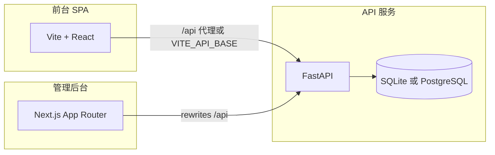
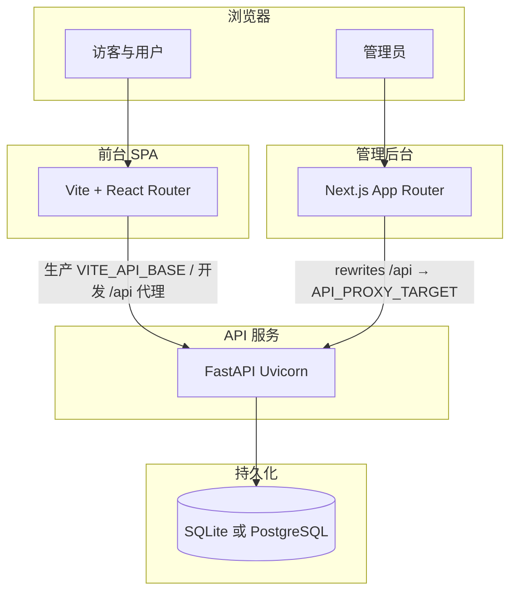

# 手册 B：架构、程序说明、API 与源代码索引

本文档由原 **02 / 17 / 06 / 18 / 07** 合并。

---

# AI 工具导航站 — 架构与程序说明

## 1. 产品定位

面向最终用户的 **AI 工具发现、分类浏览、详情与对比**，以及 **登录用户提交工具、收藏与个人页**；管理端提供 **工具审核、用户与评论治理、流量看板、商业化订单、首页搜索联想词与系统设置**等。

## 2. 技术架构（三端）



- **前台**（`frontend/`）：Vite 5 + React 19 + React Router；Tailwind；`src/lib/api.ts` 统一请求。
- **后台管理**（`admin/`）：Next.js 14；Zustand 持久化管理员 token；`lib/admin-api.ts` 调用同源 `/api`。
- **服务端**（`backend/`）：FastAPI；默认 **SQLite**（`data/app.db`），可选 **`DATABASE_URL`** 使用 **PostgreSQL**；JWT + bcrypt；启动时 `init_db`、种子、演示账号。

## 3. 目录与职责

| 路径 | 职责 |
|------|------|
| `backend/app/main.py` | 应用工厂、CORS、路由挂载、**lifespan** 启动链（建库/种子/演示账号） |
| `backend/app/db.py` | 连接 DB（SQLite 或 PG）、建表/迁移入口 |
| `backend/app/db_util.py` | PG 适配与 SQL 方言辅助 |
| `backend/app/security.py` | JWT 签发与密码哈希 |
| `backend/app/deps_auth.py` | `get_current_admin` / `get_optional_user_id` |
| `backend/app/analytics_service.py` | 管理端大盘与页面统计 SQL |
| `backend/app/routers/*.py` | 各领域 HTTP 接口（见 API 清单） |
| `frontend/src/app/App.tsx` | 根布局与路由出口 |
| `frontend/src/app/routes.tsx` | 页面路由表 |
| `frontend/src/app/contexts/*` | 语言、登录态 |
| `frontend/src/app/hooks/usePageTracking.ts` | PV/停留埋点 |
| `admin/app/admin/*` | 各后台页面 |
| `admin/components/*` | 侧边栏（读 `admin_settings.admin_menu_items`）、图表、弹窗等 |

`frontend/src/app/components/ui/*` 为基于 shadcn 风格的通用 UI（**现 14 个文件**：按钮、表单控件、对话框、标签页等）；**BACKLOG-A** 已闭见 [05-工程优化与运维备忘.md](./手册-A-部署安全-发布与运维.md)。

## 4. 数据流要点

1. **首页**：并行请求 `/api/tools`、`/api/categories`、`/api/search-suggestions`、`/api/site/home_seo`、`/api/site/ui_toasts`（见 `useHomeData.ts`）。**搜索联想词**数据来自表 **`search_suggestion`**，管理端在 **`/admin/search-suggestions`** 维护（见 **`/api/admin/search-suggestions*`**）。**顶栏品牌**由 `Navigation` 读 **`home_seo`**（**`brand_title` / `brand_icon_emoji`** 等），管理端优先 **「首页 SEO」**（`/admin/home-seo`），缺省标题 `AI Tools Hub`。
2. **工具详情**：`/api/tools/{slug}/detail?locale=`；404 时可读 `/api/site/not_found` 展示文案。
3. **登录/注册**：写入 `localStorage` 的 `user` 与 `access_token`；首屏挂载时用 **`GET /api/me`** 校验 JWT，**401 则清空**用户快照与 token（避免过期 token「假登录」）。个人展示字段持久化见 **`PUT /api/me/profile`**（与 `AuthContext.refreshUser`）。个人中心 **活动与统计**登录态下优先 **`GET /api/me/activity`**，与 **`/api/site/profile`** 中 **UI 文案**合并展示。
4. **提交工具**：必须带 JWT，`sub` 写入 `tool.submitted_by_user_id`。
5. **管理员**：登录接口与普通用户相同，前端校验 `role === "admin"` 后写入仅后台使用的 token store。

## 5. 环境变量一览

| 变量 | 位置 | 含义 |
|------|------|------|
| `ENVIRONMENT` | 后端 | 设为 **`production`** 时启用 **`JWT_SECRET` 强校验**，且演示账号逻辑不覆盖已有用户密码（见 `env_guard` / `ensure_accounts`） |
| `JWT_SECRET` | 后端 | JWT 签名密钥 |
| `AI_INSIGHT_LLM_API_KEY` | 后端 | （可选）管理端 **AI SEO 分析** 的全局 API Key，**优先于**库内 **`ai_insight_llm_provider.api_key`**（见 [12-需求-AI-SEO与流量分析助手.md](./手册-D-需求-商业化-AI-SEO-爬虫.md)） |
| `DATABASE_URL` | 后端 | （可选）PostgreSQL 连接串；未设则用 SQLite |
| `ALLOWED_ORIGINS` | 后端 | CORS 允许源，逗号分隔；见 `main.py` |
| `PUBLIC_SITE_URL` | 后端 | 公网站点根（sitemap/robots 等），见 `01-部署指南.md` |
| `VITE_API_BASE` | 前台构建 | 生产 API 根 URL |
| `VITE_PUBLIC_SITE_URL` | 前台构建 | 浏览器端 canonical/OG 根 URL |
| `DEV_API_PROXY` | 前台开发 | Vite 代理后端地址 |
| `API_PROXY_TARGET` | 管理端构建/启动 | Next rewrites 目标 |

各目录提供 `.env.example`。

## 6. 与《源代码文件索引》的关系

业务与联调相关文件在 `docs/手册-B-架构程序与API索引.md` 中按文件逐段解释；通用 UI 组件仅列表索引，避免重复。

## 7. 待办与验收

跨文档的**未关闭事项汇总**（安全、部署、测试执行、SEO 缺口等）见 [**03-开放事项总表.md**](./手册-C-开放事项与演进对照.md)（**§0** 为自 `01`～`10` 整理的待处理清单速览，**§1** 为一览表，**§4.2 BACKLOG-CP** 对照 [**11-控制面演进需求-CP-BACKLOG.md**](./手册-C-开放事项与演进对照.md)）；**管理端 AI SEO/流量分析**（待立项）见 [**12-需求-AI-SEO与流量分析助手.md**](./手册-D-需求-商业化-AI-SEO-爬虫.md)。上线勾选模板见 [**09-上线发布验收清单.md**](./手册-A-部署安全-发布与运维.md)。


---

# 程序说明书（完整）

本文描述 **AI 工具导航站** 当前仓库的**程序结构、运行时行为、数据模型概览、接口分层与三端职责**，作为开发与运维的**单一入口说明**。路径、方法、请求体等**以 [06-API接口参考.md](./手册-B-架构程序与API索引.md) 为权威细表**；文件级索引见 [07-源代码文件索引.md](./手册-B-架构程序与API索引.md)。

---

## 1. 文档范围与读者

- **范围**：`backend/app/`、`frontend/src/`、`admin/app/` 等自研源码及 `backend/sql/` 模式；不含 `node_modules`、虚拟环境、构建产物。
- **读者**：后端/前端/管理端开发、运维、测试、技术产品（需理解能力边界时）。

---

## 2. 系统上下文



---

## 3. 技术栈与仓库目录

| 部分 | 技术 | 根目录 |
|------|------|--------|
| API | Python 3.10+、FastAPI、Uvicorn、PyJWT、passlib/bcrypt；可选 psycopg | `backend/` |
| 前台 | React 19、Vite 5、React Router、Tailwind、shadcn 风格 UI | `frontend/` |
| 管理端 | Next.js 14、Zustand（token 持久化） | `admin/` |
| 模式 | SQLite `schema.sql`、PostgreSQL `schema.pg.sql` | `backend/sql/` |
| 种子 | 空库导入业务与站点 JSON | `backend/data/seed/` |

---

## 4. 应用入口与生命周期（后端）

### 4.1 工厂与全局实例

- **`backend/app/main.py`**：`create_app()` 组装 **CORS**、注册全部 **`APIRouter`**（统一前缀 **`/api`**），并导出模块级 **`app`** 供 Uvicorn 加载。
- **OpenAPI 版本**：与 **`release_meta.api_version()`** 一致（环境变量 **`APP_VERSION`** 可覆盖，默认 `1.0.0`）。

### 4.2 Lifespan 启动链（顺序敏感）

1. **`enforce_production_secrets()`**（`env_guard`）：`ENVIRONMENT=production` 且 `JWT_SECRET` 弱/占位 → **进程退出**。
2. **`warn_production_cors_origins()`**：生产未设 `ALLOWED_ORIGINS` 或为 `*` → **stderr WARN**，不退出。
3. **`init_db()`**：建表 + 执行 **`migrate.py`** 中登记的增量迁移。
4. **`run_seed_if_empty()`**：仅当库为空时导入种子数据。
5. **`ensure_dev_accounts()`**：保证演示管理员与普通用户存在；**生产**对已存在用户**不覆盖** `password_hash`。
6. **`seed_monetization_sample(conn)`**：订单表为空时插入示例推广订单（需存在 demo 用户与 active 工具）。
7. **`asyncio.create_task(crawler_scheduler_loop())`**：进程内约每分钟巡检 **定时爬虫**；停机时 cancel 并 `await` 收尾。

### 4.3 CORS 策略（摘要）

- 环境变量 **`ALLOWED_ORIGINS`**：逗号分隔完整 Origin；**`*`** 时 `allow_credentials=false`。
- **未设置**：`allow_origins=[]`，依赖 **`allow_origin_regex`** 匹配本机与常见 **RFC1918 私网** Origin，便于局域网联调；**公网前端跨域须显式配置白名单**。

---

## 5. 数据库与迁移

### 5.1 连接与方言

- **`backend/app/db.py`**：默认 SQLite 文件路径由 **`paths.py`** 解析；若设置 **`DATABASE_URL`**（`postgresql://` / `postgres://`）则使用 **PostgreSQL** 与 **`db_util.PgConnectionAdapter`**。
- **`backend/app/db_util.py`**：占位符、DDL 分句、Row 形态等 PG 适配。

### 5.2 表清单（逻辑模型）

以下表定义见 **`backend/sql/schema.sql`**（及 PG 对应脚本）：

| 表 | 用途 |
|----|------|
| `category` | 工具分类 |
| `tool` | 工具主实体（审核状态、slug、提交者等） |
| `tool_feature` / `tool_screenshot` / `tool_pricing_plan` | 详情子资源 |
| `tool_alternative` | 替代工具关系 |
| `review` | 用户评论（UGC 状态） |
| `search_suggestion` | 首页搜索联想词 |
| `translation` | i18n 键值 |
| `comparison_page` | 对比落地页 JSON |
| `site_json` | 键值型站点大块配置（含 `page_seo`、`admin_settings`、各类 UI 块等） |
| `locale_meta` | 语言列表元数据 |
| `app_user` | 用户与角色、封禁、展示字段 |
| `user_favorite` | 收藏 |
| `page_view_log` / `page_analytics_daily` | 埋点原始与按日聚合 |
| `monetization_order` | 推广订单 |
| `ai_insight_*` | AI SEO 提示词、模型连接、运行记录 |
| `crawler_source` / `crawler_job` / `crawler_job_preview` | 内容爬虫数据源与任务 |

### 5.3 迁移

- **`backend/app/migrate.py`**：版本化增量 SQL；由 **`init_db`** 在启动时应用。发布含迁移版本时须按 [16](./手册-A-部署安全-发布与运维.md) 执行备份与预发验证。

---

## 6. HTTP API 分层（路由注册顺序与职责）

**统一前缀**：`/api`（健康检查亦为 **`GET /api/health`**）。

| 分组 | 模块文件 | 职责摘要 |
|------|----------|----------|
| 健康 | `health_release.py` | `GET /health`：存活、版本、`database_backend`、可选 build 元数据 |
| 工具与目录 | `tools.py`、`catalog.py` | 列表、详情（含 **`promotion_active`**）、分类、搜索建议、提交选项 |
| 站点块 | `site.py` | `GET /site/{key}`、`/dashboard-data` |
| SEO 公开 | `seo_public.py` | `sitemap.xml`、`robots.txt` |
| 国际化 | `i18n.py` | 文案 bundle、语言列表 |
| 对比 | `comparisons.py` | 对比页 JSON（含弱曝光字段） |
| 认证 | `auth.py` | 登录、注册 |
| 当前用户 | `user_profile.py`、`user_settings.py`、`user_favorites.py`、`user_activity.py`、`user_orders.py` | `/me*` 系列 |
| 埋点 | `track.py` | `POST /track`，Cookie `track_sid` |
| 投稿 | `submissions.py` | 登录用户提交工具 |
| 管理端 | `admin_*.py` | 大盘、分析、工具审核、用户、评论、订单、设置、站点 JSON、翻译、联想词、对比页、爬虫、**AI SEO** 等 |

**管理员鉴权**：依赖 **`deps_auth.get_current_admin`**，JWT 内 **`role=admin`**。

**详表**（方法、路径、请求体、错误码）：**[18-REST-API完整接口文档.md](./手册-B-架构程序与API索引.md)**（全量）；日常精简查阅 **[06-API接口参考.md](./手册-B-架构程序与API索引.md)**。

---

## 7. 核心业务规则（节选）

### 7.1 工具上架

- 公开列表与详情仅 **`moderation_status=active`**（具体字段以 `tools` 路由查询为准）。

### 7.2 推广弱曝光

- **`backend/app/promotion_util.py`**：某 `tool_id` 存在 **`payment_status=paid`** 且当日在 **`valid_from`～`valid_until`** 内则视为推广中。
- **详情接口**返回 **`promotion_active`**；**对比页**通过工具**展示名**与 `tool.name` 匹配后再打标（名不一致则无标）。决策见 [10](./手册-D-需求-商业化-AI-SEO-爬虫.md) §6。

### 7.3 AI SEO 助手

- 只读组装站点与流量快照，调用 **OpenAI 兼容** `chat/completions`；结果入库为历史记录，**不自动写** `site_json` 或工具表。见 [12](./手册-D-需求-商业化-AI-SEO-爬虫.md)。

### 7.4 内容爬虫

- 管理端配置 **`crawler_source`**，任务写 **`crawler_job`**；可预览后提交，默认写入 **`tool` 为 `pending`**。定时由 **`crawler_scheduler`** 驱动，可用 **`CRAWLER_SCHEDULER_ENABLED`** 关闭。见 [13](./手册-D-需求-商业化-AI-SEO-爬虫.md)。

---

## 8. 前台应用（`frontend/`）

### 8.1 构建与运行时配置

- **`src/lib/api.ts`**：解析 **`VITE_API_BASE`**（生产）或开发代理/可选 **`VITE_DEV_API_BASE`**。
- **`src/lib/siteUrl.ts`**：**`VITE_PUBLIC_SITE_URL`** 与 canonical/OG 根。

### 8.2 路由

- **`src/app/routes.tsx`**：`createBrowserRouter`，主要路径包括 `/`、`/tool/:id`（slug）、`/compare`、`/compare/:toolName`、`/dashboard`、`/profile`、`/orders/:orderId`、`/favorites`、`/settings`、`/submit`、`/sitemap`、`/guide`、`/more`、`/support/*`、404。
- **`TrackingLayout`**：路由变化时上报 **`POST /api/track`**。

### 8.3 状态与国际化

- **`AuthContext`**：`localStorage` 中 `user` 与 `access_token`；挂载 **`GET /api/me`** 校验 JWT，401 则清空。
- **`LanguageContext`**：拉取 **`/api/i18n/{locale}`** 等。

### 8.4 SEO 组件

- **`SEO.tsx`**、**`useResolvedPageSeo`**：与 **`/api/site/page_seo`** 及管理端 **Page SEO** 配置对齐（见 [08](./08-管理后台与SEO控制面.md)）。

---

## 9. 管理端应用（`admin/`）

### 9.1 API 代理

- **`next.config.mjs`**：将 **`/api/*`** rewrite 到 **`API_PROXY_TARGET`**（默认 `http://127.0.0.1:8000`）。

### 9.2 主要页面路径（App Router）

- **`/login`**：非 admin 拒绝进入后台。
- **`/admin/*`**：`dashboard`、`analytics`、`tools`、`tools/[id]/edit`、`users`、`reviews`、`monetization`、`page-seo`、`tool-json-ld`、`site-blocks`、`search-suggestions`、`site-submit`、`site-dashboard`、`home-seo`、`translations`、`comparisons`、`settings`、`ai-seo-insights`（及 **`runs/[id]`**）、**`crawler`** 等。
- 侧栏菜单：优先 **`GET /api/admin/settings`** 中 `admin_menu_items`，失败或无数据时用内置 fallback。

---

## 10. 安全与鉴权

- **密码**：bcrypt（版本约束见 `requirements.txt`）。
- **JWT**：签发与校验在 **`security.py`**；依赖头 **`Authorization: Bearer`**。
- **生产**：**`ENVIRONMENT=production` + 强 `JWT_SECRET`**；CORS 白名单与 HTTPS 由部署层保证（见 [16](./手册-A-部署安全-发布与运维.md)、[04](./手册-A-部署安全-发布与运维.md)）。

---

## 11. 脚本与自动化

| 脚本 / 工作流 | 用途 |
|-----------------|------|
| `backend/scripts/publish_smoke.sh` | 对 `BASE_URL` 做公开接口抽样（401/200） |
| `backend/scripts/crawler_acceptance.py` | 爬虫能力验收（临时库，见 [06](./手册-B-架构程序与API索引.md)） |
| `.github/workflows/ci.yml` | 三端 build + smoke |

---

## 12. 与细分文档的映射

| 主题 | 文档 |
|------|------|
| 架构精要、环境变量表 | [02-架构与程序说明.md](./手册-B-架构程序与API索引.md) |
| REST 全清单 | [06-API接口参考.md](./手册-B-架构程序与API索引.md) |
| 源文件职责 | [07-源代码文件索引.md](./手册-B-架构程序与API索引.md) |
| 后台 ↔ 前台 SEO 控制矩阵 | [08-管理后台与SEO控制面.md](./08-管理后台与SEO控制面.md) |
| 待办与 BACKLOG | [03](./手册-C-开放事项与演进对照.md)、[11](./手册-C-开放事项与演进对照.md) |
| 商业化、AI SEO、爬虫需求 | [10](./手册-D-需求-商业化-AI-SEO-爬虫.md)、[12](./手册-D-需求-商业化-AI-SEO-爬虫.md)、[13](./手册-D-需求-商业化-AI-SEO-爬虫.md) |
| 部署与发布 SOP | [16-部署与发布完整说明书.md](./手册-A-部署安全-发布与运维.md) |
| 产品商业综合评估 | [15-产品市场商业与程序综合评估梗概.md](./手册-E-评估与变更日志.md) |

---

## 13. 版本与维护

- **程序版本号**：以后端 **`APP_VERSION`** / OpenAPI / **`GET /api/health`** 的 `api_version` 为准。
- **本文**：随仓库大功能变更更新；接口细节变更请同步 **[06](./手册-B-架构程序与API索引.md)**，避免双处冗长复制。

---

*本文档为「程序说明书」完整版；若与代码不一致，以代码与 [06](./手册-B-架构程序与API索引.md) 为准并应修正本文。*


---

# REST API 接口清单（FastAPI，统一前缀 `/api`）

**完整版（全路径索引 + 分节详表）**：[**18-REST-API完整接口文档.md**](./手册-B-架构程序与API索引.md) — 与 `backend/app/routers` 逐项对齐，发布对账请以 **18** 为准。

## 联调说明

| 客户端 | 如何将 `/api` 转到后端 |
|--------|------------------------|
| 前台 Vite 开发 | `vite.config.ts` 代理到 `DEV_API_PROXY`（默认 `http://127.0.0.1:8000`） |
| 前台生产 | 设置 `VITE_API_BASE=https://你的API域名`（无尾斜杠），与后端 `ALLOWED_ORIGINS` 对齐 |
| 管理后台 Next | `next.config.mjs` rewrites：`API_PROXY_TARGET`（默认 `http://127.0.0.1:8000`） |

## 通用约定

- 除特殊说明外，响应为 JSON。
- 需登录用户的接口：`Authorization: Bearer <JWT>`。
- 管理员接口：JWT 内 `role` 必须为 `admin`。
- 部分接口使用 `credentials: "include"` 以接收埋点 Cookie `track_sid`。

---

## 健康检查 `health_release.py`

| 方法 | 路径 | 说明 |
|------|------|------|
| GET | `/api/health` | 无鉴权；`status`、`api_version`、`database_backend`、可选 `build.git_sha` / `build.build_id`（见 [16-部署与发布完整说明书.md](./手册-A-部署安全-发布与运维.md)） |

---

## 认证 `app/routers/auth.py`

| 方法 | 路径 | 请求体 | 说明 |
|------|------|--------|------|
| POST | `/api/auth/login` | `{ "email", "password" }` | 成功返回用户信息 + `access_token`、`token_type`；401 `invalid`；403 `banned` |
| POST | `/api/auth/signup` | `{ "email", "password", "name" }` | 成功同上；400 `email_exists` |

---

## 工具与目录 `tools.py` / `catalog.py`

| 方法 | 路径 | 查询/参数 | 说明 |
|------|------|-----------|------|
| GET | `/api/tools` | `locale` 默认 `en` | 已上架工具列表（`moderation_status=active`） |
| GET | `/api/tools/{slug}/detail` | `locale` | 详情含特性、截图、定价方案、评论、替代工具、`messages`；**`promotion_active`**（bool）：存在 `paid` 且在约的 `monetization_order` 时为 `true`（弱曝光合规标） |
| GET | `/api/categories` | `locale` | 分类列表 |
| GET | `/api/search-suggestions` | — | 字符串数组 |
| GET | `/api/submit-options` | `locale` | 提交表单元数据：`categories`、`pricing_options`、`ui` |

---

## 站点块与仪表盘 `site.py`

| 方法 | 路径 | 说明 |
|------|------|------|
| GET | `/api/site/{key}` | `site_json.content_key`，如 `home_seo`、`profile`、`favorites` 等；404 `not_found` |
| GET | `/api/site/frontend_nav` | 从 `admin_settings.frontend_menu_items` 解析主导航；空数组时前台用默认 |
| GET | `/api/dashboard-data` | `site_json` 中 `dashboard` 块 |

前台实际调用的 `key` 示例（需在种子数据中存在）：`home_seo`（常用字段 **`keywords`**、**`brand_title`** 顶栏名）、`ui_toasts`、`profile`、`favorites`、`compare_interactive`、`sitemap`、`more`、`guide`、`not_found` 等。

---

## 公开爬虫文件 `seo_public.py`

| 方法 | 路径 | 说明 |
|------|------|------|
| GET | `/api/seo/sitemap.xml` | **application/xml**。根 URL 来自环境变量 **`PUBLIC_SITE_URL`**（无则开发默认 `http://127.0.0.1:5173`）。**静态** `<url>` 来自 **`site_json.seo_sitemap_static.urls`**，无效则后端常量；**动态** 为已上架 **`tool`**、**`comparison_page`** 全表 slug；**`<loc>`** 等已 XML 转义；工具 URL 在 **`created_at`** 可取 `YYYY-MM-DD` 时带 **`<lastmod>`**。 |
| GET | `/api/seo/robots.txt` | **text/plain**。默认 `Allow: /` 与 **`Sitemap: {PUBLIC_SITE_URL}/api/seo/sitemap.xml`**。若 **`site_json.seo_robots.raw_body`** 为非空字符串，则**整文件**为该内容；否则可读 **`sitemap_url`** / **`sitemap_urls`** / **`disallow_paths`**（见 [08-管理后台与SEO控制面.md](./08-管理后台与SEO控制面.md) §2.2）。 |

管理端在 **站点 JSON** 中维护 **`seo_sitemap_static`**、**`seo_robots`**（**`GET/PUT /api/admin/site-json/{key}`** 白名单）。

---

## 国际化 `i18n.py`

| 方法 | 路径 | 说明 |
|------|------|------|
| GET | `/api/i18n/{locale}` | 该语言文案键值对 |
| GET | `/api/locales` | `[{ code, label, flag }]` |

---

## 对比页 SEO `comparisons.py`

| 方法 | 路径 | 说明 |
|------|------|------|
| GET | `/api/comparisons/{slug}` | `comparison_page` 表；404 `not_found`；响应内 **`mainTool` / `alternatives[]`** 可含 **`promotion_active`**（按工具**展示名**匹配 `tool.name` 后查订单，名不一致则无标） |

---

## 埋点 `track.py`

| 方法 | 路径 | 请求体 | 说明 |
|------|------|--------|------|
| POST | `/api/track` | `{ page_path, previous_path?, dwell_seconds? }` | 可选 Bearer；设置/复用 Cookie `track_sid`；写 `page_view_log` |
| POST | `/api/track/outbound` | `{ tool_slug, page_path }` | 可选 Bearer；复用 `track_sid`；工具详情「访问官网」写 `outbound_click_log`（仅已上架 slug） |

---

## 当前用户（需登录 JWT）`user_profile.py` / `user_settings.py`

| 方法 | 路径 | 请求体 | 说明 |
|------|------|--------|------|
| GET | `/api/me` | — | 与登录响应一致的用户展示字段（`id`、`email`、`name`、`avatar`、`bio`、`role`） |
| PUT | `/api/me/profile` | `{ "display_name", "avatar_emoji", "bio" }` | 更新 `app_user` 展示字段 |
| GET | `/api/me/settings` | — | `settings_json` 偏好 |
| PUT | `/api/me/settings` | `{ "payload": { ... } }` | 覆盖偏好（与前台 Settings 页结构一致） |

### 收藏 `user_favorites.py`

| 方法 | 路径 | 说明 |
|------|------|------|
| GET | `/api/me/favorites` | 查询参数 `locale`（默认 `en`）；响应与 **`/api/site/favorites`** 同形：`breadcrumb_label`、`items`、`filter_categories`（仅 **`moderation_status=active`** 工具） |
| GET | `/api/me/favorites/check` | 查询参数 **`slug`**；`{ "favorited": bool }` |
| POST | `/api/me/favorites` | body `{"slug":"工具 slug"}`；`INSERT OR IGNORE` 幂等；工具不存在或非正常上架 → 404 `tool_not_found` |
| DELETE | `/api/me/favorites/{slug}` | 取消收藏 |

### 个人动态 `user_activity.py`

| 方法 | 路径 | 说明 |
|------|------|------|
| GET | `/api/me/activity` | 查询参数 **`locale`**（默认 `en`）；`{ "activity": [...], "stats": [...] }`——与 **`site_json.profile`** 同形；**activity** 来自 **`user_favorite` / `tool.submitted_by_user_id` / `review.reviewer_user_id`** |

### 推广订单 `user_orders.py`

| 方法 | 路径 | 说明 |
|------|------|------|
| GET | `/api/me/orders` | `{ "items": [...] }`；每项含 `id`、`tool_id`、`tool_name`、`tool_slug`、`amount_cents`、`payment_status`、`valid_from`、`valid_until`、`extra_pv`/`uv`/`uid`、`created_at` |
| GET | `/api/me/orders/{order_id}` | 同上字段的单对象；非本人或无记录 → **404** `not_found` |

---

## 用户提交工具 `submissions.py`

| 方法 | 路径 | 鉴权 | 请求体 | 说明 |
|------|------|------|--------|------|
| POST | `/api/submissions/tool` | 必须登录（Bearer） | `name, website, description, category_slug, pricing?, long_description?, features?` | 401 `login_required`；工具 `moderation_status=pending` |

---

## 管理后台（均需管理员 JWT）

### 大盘 `admin_dashboard.py`

| 方法 | 路径 | 说明 |
|------|------|------|
| GET | `/api/admin/dashboard/summary` | 汇总指标 |
| GET | `/api/admin/dashboard/trend` | `days`: 7 \| 30 \| 90；或 **`start_date`+`end_date`**（`YYYY-MM-DD`）自定义区间（上限约 366 天）；`{ data: [...] }` |

### 分析 `admin_analytics.py`

| 方法 | 路径 | 查询参数 | 说明 |
|------|------|----------|------|
| GET | `/api/admin/analytics/pages` | `start_date`、`end_date`（YYYY-MM-DD）、`sort_by`=`pv`\|`uv`\|`uid` | 页面流量行数据 |

### AI SEO / 流量分析 `admin_ai_insights.py`（PROD-AI-SEO）

服务端组装 **page_seo / home_seo / sitemap·robots 摘要** 与 **近 7 日流量聚合**，与可配置提示词一并调用 **OpenAI 兼容** `POST {base}/v1/chat/completions`；可维护**多条**连接（表 **`ai_insight_llm_provider`**），**手动勾选默认启用**；密钥优先 **`AI_INSIGHT_LLM_API_KEY`**（全局），其次该行 **`api_key`** 或 **`api_key_env_name`**。详见 [12-需求-AI-SEO与流量分析助手.md](./手册-D-需求-商业化-AI-SEO-爬虫.md)。

| 方法 | 路径 | 说明 |
|------|------|------|
| GET | `/api/admin/ai-insights/configs` | 提示词配置列表 |
| POST | `/api/admin/ai-insights/configs` | body：`name`、`system_prompt`、`user_prompt_template`、`is_default?` |
| PUT | `/api/admin/ai-insights/configs/{id}` | 部分或全部更新同上字段 |
| DELETE | `/api/admin/ai-insights/configs/{id}` | 删除配置 |
| GET | `/api/admin/ai-insights/providers` | 多条模型连接列表（**无 api_key 明文**；`is_default` 表示当前**默认启用**，分析时 `provider_id` 省略则用该条） |
| POST | `/api/admin/ai-insights/providers` | 新建：`name`、`base_url`、`model`、`timeout_sec`、`temperature`、`extra_headers_json`、`api_key_env_name?`、`api_key?`、`is_default?` |
| PUT | `/api/admin/ai-insights/providers/{id}` | 更新同上字段（部分可选）；`is_default: true` 时清除其他连接的默认标记 |
| DELETE | `/api/admin/ai-insights/providers/{id}` | 删除；**400** `last_provider` 至少保留一条；若删的是默认则自动把最小 `id` 设为默认 |
| POST | `/api/admin/ai-insights/run` | body：`config_id?`、`provider_id?`（省略则用 `is_default=1` 的连接）；成功返回 `run_id`、`output_text` 等；**400** `missing_api_key`；**404** `provider_not_found`；**429** `rate_limited_ai_insight`；**502** 供应商错误摘要 |
| GET | `/api/admin/ai-insights/runs` | `limit`、`offset`；分页列表 |
| GET | `/api/admin/ai-insights/runs/{id}` | 详情（全文输出与快照 JSON） |
| DELETE | `/api/admin/ai-insights/runs/{id}` | 删除记录 |
| GET | `/api/admin/ai-insights/runs/{id}/seo-tasks` | 该次分析衍生的 **SEO 执行任务**列表；项含 **`kind`**、`payload_json` 等 |
| POST | `/api/admin/ai-insights/runs/{id}/seo-tasks` | body：`path`、`patch`；手工插入 **`page_seo_patch`** 草案（与 Page SEO 字段白名单一致） |
| POST | `/api/admin/ai-insights/runs/{id}/seo-tasks/generate` | query：`replace_drafts?`；模型从**成功**报告抽取 JSON（`task_type`：`page_seo` / `home_seo` / `seo_robots` / `code_pr_hint` 等）并落 **draft** |
| POST | `/api/admin/ai-insights/seo-tasks/{task_id}/approve` | 批准后允许 **apply**（`code_pr_hint` 除外） |
| POST | `/api/admin/ai-insights/seo-tasks/{task_id}/reject` | 拒绝草案或撤销已批（未应用前） |
| POST | `/api/admin/ai-insights/seo-tasks/{task_id}/apply` | 按 **`kind`** 合并写入 **`site_json`**：**`page_seo`** / **`home_seo`** / **`seo_robots`**；成功则插入 **`ai_insight_seo_apply_audit`**；**400** `code_pr_hint_no_auto_apply` |
| DELETE | `/api/admin/ai-insights/seo-tasks/{task_id}` | 仅 **`draft`** 可删 |
| GET | `/api/admin/ai-insights/runs/{id}/seo-apply-audits` | 该 run 下 **apply** 审计列表（含 `content_key`、前后快照文本、`rolled_back_at`） |
| POST | `/api/admin/ai-insights/seo-apply-audits/{audit_id}/rollback` | 当前库该键 canonical 仍等于审计 **`after`** 时回写 **`before`**；**409** `rollback_conflict_current_changed` |

### 工具审核 `admin_tools.py`

| 方法 | 路径 | 说明 |
|------|------|------|
| GET | `/api/admin/tools` | `tab`: `all`\|`pending`\|`active`\|`rejected` |
| PATCH | `/api/admin/tools/{tool_id}/status` | body: `status`（`ACTIVE`/`APPROVED`→active，`REJECTED`→rejected）+ `reject_reason` |
| PATCH | `/api/admin/tools/{tool_id}/featured` | `{ "featured": bool }` |
| PATCH | `/api/admin/tools/{tool_id}` | 部分更新：`name`、`description`、`tagline`、`long_description`、`website_url`、`pricing_type`、`icon_emoji`、`category_slug`（**不含 slug**） |
| GET | `/api/admin/tools/{tool_id}/review-detail` | 审核用详情 |

### 用户 `admin_users.py`

| 方法 | 路径 | 说明 |
|------|------|------|
| GET | `/api/admin/users` | 用户列表与统计 |
| PATCH | `/api/admin/users/{user_id}/role` | `{ "role": "user"\|"developer"\|"admin" }` |
| PATCH | `/api/admin/users/{user_id}/ban` | `{ "banned": bool }` |
| POST | `/api/admin/users/{user_id}/send-email` | **无 body**；配置 **`SMTP_HOST`+`SMTP_FROM`** 时真实发信（`smtplib`）；否则 **`stub: true`**；失败可能 **502 `smtp_failed:...`** |

### 评论 `admin_reviews.py`

| 方法 | 路径 | 说明 |
|------|------|------|
| GET | `/api/admin/reviews` | 列表 |
| PATCH | `/api/admin/reviews/{review_id}/status` | `{ "ugc_status": "published"\|"reported"\|"hidden" }` |
| DELETE | `/api/admin/reviews/{review_id}` | 物理删除该条评论 |

### 商业化 `admin_monetization.py`

| 方法 | 路径 | 说明 |
|------|------|------|
| GET | `/api/admin/monetization/summary` | 按支付状态汇总、笔数与金额等 |
| GET | `/api/admin/monetization/orders` | 订单列表；支持查询参数按 `payment_status` 过滤 |
| PATCH | `/api/admin/monetization/orders/{order_id}` | body：`payment_status` 与/或 `valid_until`（ISO 日期）；至少一项 |

### 系统设置 `admin_settings.py`

| 方法 | 路径 | 说明 |
|------|------|------|
| GET | `/api/admin/settings` | `{ "payload": object }`，存 `site_json.admin_settings` |
| PUT | `/api/admin/settings` | `{ "payload": object }` 整体覆盖 |

### 页面 SEO `admin_page_seo.py`

| 方法 | 路径 | 说明 |
|------|------|------|
| GET | `/api/admin/page-seo` | 站内 path 清单、标签、已保存 `entries` |
| PUT | `/api/admin/page-seo` | `{ "entries": { "<path>": { ... } } }`；写入 `site_json.page_seo` |

### 站点 JSON（白名单键）`admin_site_json.py`

| 方法 | 路径 | 说明 |
|------|------|------|
| GET | `/api/admin/site-json/{key}` | **404** 若 key 不在白名单；见 [18](./手册-B-架构程序与API索引.md) §5.10 |
| PUT | `/api/admin/site-json/{key}` | `{ "payload": object }`；经按 key 的形态校验 |

### 翻译 `admin_translations.py`

| 方法 | 路径 | 说明 |
|------|------|------|
| GET | `/api/admin/translations` | Query **`locale`** 可选 |
| PUT | `/api/admin/translations` | 单行 upsert：`locale`、`msg_key`、`msg_value` |
| DELETE | `/api/admin/translations` | Query **`locale`、`msg_key`** |
| GET | `/api/admin/translations/export` | Query **`format`**=`json`\|`ndjson` |
| POST | `/api/admin/translations/import` | 批量 upsert；可选 **`replace_locale`** 先清空该语言 |

### 对比落地页 `admin_comparison_pages.py`

| 方法 | 路径 | 说明 |
|------|------|------|
| GET | `/api/admin/comparison-pages` | `{ "slugs": [...] }` |
| GET | `/api/admin/comparison-pages/{slug}` | `{ "slug", "payload" }` |
| PUT | `/api/admin/comparison-pages/{slug}` | `{ "payload": { ... } }` 整包覆盖 |

### 搜索联想词 `admin_search_suggestions.py`

| 方法 | 路径 | 请求体 / 参数 | 说明 |
|------|------|-----------------|------|
| GET | `/api/admin/search-suggestions` | — | `{ "items": [ { "id", "text", "sort_order" } ] }`，与公开 **`GET /api/search-suggestions`** 同源表 |
| POST | `/api/admin/search-suggestions` | `{ "text", "sort_order"? }` | 新增；**409** `duplicate_text` 与 **`text` 唯一**冲突 |
| PUT | `/api/admin/search-suggestions` | `{ "id", "text"?, "sort_order"? }` | 至少改一项；**404** `not_found`；**409** 文案重复 |
| DELETE | `/api/admin/search-suggestions` | 查询参数 **`id`** | **404** 若不存在 |

### 内容爬虫 `admin_crawler.py`（JSON 订阅 / PROD-CRAWLER MVP）

| 方法 | 路径 | 请求体 / 参数 | 说明 |
|------|------|-----------------|------|
| GET | `/api/admin/crawler/stats` | — | 全历史汇总：`total_runs`、`success_runs`、`failed_runs`、`other_runs`、`total_items_processed`、`total_committed_ins`、`total_committed_upd`（来自 `crawler_job` 聚合） |
| GET | `/api/admin/crawler/sources` | — | `{ "data": [ 数据源 ] }`，含定时字段：`auto_crawl_enabled`、`crawl_interval_minutes`、`daily_max_items`、`scheduled_max_items_per_run`、`auto_dry_run`、`auto_write_strategy`、`last_auto_run_at`、`daily_quota_date`、`daily_quota_used` |
| POST | `/api/admin/crawler/sources` | `{ "name", "feed_url", … }` 及可选定时字段 | 新建；`config_json` 见需求文档；默认定时关闭 |
| PUT | `/api/admin/crawler/sources/{id}` | 部分字段（含上述定时键） | 至少一项；**404** `not_found` |
| DELETE | `/api/admin/crawler/sources/{id}` | — | 级联删除关联任务 |
| GET | `/api/admin/crawler/jobs` | 查询 **`limit`**（默认 50） | 最近任务列表 |
| POST | `/api/admin/crawler/jobs` | `{ "source_id", "dry_run"?, "write_strategy"?, "max_items"? }` | **同步**拉取并写预览；`dry_run=true` 时状态 **`preview_ready`**，否则当场 **`commit`** 写入 `tool`（默认 **pending**） |
| GET | `/api/admin/crawler/jobs/{id}` | — | 详情含 `log_text`、`summary` |
| GET | `/api/admin/crawler/jobs/{id}/preview` | **`offset`**、**`limit`** | 预览行分页 |
| POST | `/api/admin/crawler/jobs/{id}/commit` | — | 仅 **`preview_ready`** → 写入业务表；**400** 若状态不对 |

**定时执行**：API 进程 `lifespan` 内 asyncio 任务约每分钟调用 `crawler_scheduler.tick_scheduled_crawls()`；按各数据源 **`crawl_interval_minutes`** 与当日 **`daily_max_items`**（扣减 `daily_quota_used`，按服务器本地日 `daily_quota_date` 重置）创建 **`trigger_type=scheduled`** 的任务。环境变量 **`CRAWLER_SCHEDULER_ENABLED`** 为 `0` / `false` / `off` 时关闭。

**自动化验收**（Dry-run + 统计 + 定时设置 / `tick_scheduled_crawls`）：在 `backend/` 下执行  
`PYTHONPATH=. ./.venv_hb/bin/python scripts/crawler_acceptance.py`（需本机 venv 含依赖；使用临时 SQLite，不污染 `data/app.db`）。

---

## 默认演示账号（`ensure_dev_accounts`）

| 邮箱 | 密码 | 角色 |
|------|------|------|
| <admin@example.com> | admin123 | admin |
| <demo@example.com> | demo | user |

生产环境务必修改密码并更换 `JWT_SECRET`（见 [01-部署指南.md](./手册-A-部署安全-发布与运维.md)）；生产应设 **`ENVIRONMENT=production`** 以启用启动时密钥强校验（`backend/app/env_guard.py`）。

抽样自检可运行 **`backend/scripts/publish_smoke.sh`**（`BASE_URL` 指向 API 根）。

---

**待办汇总**（安全、测试、SEO 缺口等）：见 [03-开放事项总表.md](./手册-C-开放事项与演进对照.md)。


---

# REST API 完整接口文档

本文档与 **`backend/app/main.py`** 挂载方式一致，列出当前仓库内**全部** HTTP 接口的**方法、路径、鉴权、请求与响应要点**。细节实现以源码为准；联调环境说明见下文 §1。

**OpenAPI**：服务运行时访问 **`/docs`**（Swagger UI）、**`/openapi.json`**（机器可读模式）；路径相对 API 根（与 `/api` 并列，属 FastAPI 默认行为）。

| 文档关系 | 说明 |
|----------|------|
| [06-API接口参考.md](./手册-B-架构程序与API索引.md) | 精简清单 + 长说明，日常查阅 |
| **本文（18）** | **完整枚举** + 全路径索引表，发布/对账用 |

---

## 1. 基础约定

### 1.1 Base URL 与前缀

- 所有业务接口统一前缀：**`/api`**。  
- 示例：`https://api.example.com/api/tools`。

### 1.2 客户端如何访问 `/api`

| 客户端 | 配置 |
|--------|------|
| 前台开发 | Vite `vite.config.ts` 将 `/api` 代理到 `DEV_API_PROXY`（默认 `http://127.0.0.1:8000`） |
| 前台生产 | 构建变量 **`VITE_API_BASE`** = 公网 API 根（无尾斜杠）；请求发往 `{VITE_API_BASE}/api/...` |
| 管理端 | **`next.config.mjs`**：`/api/*` rewrite 到 **`API_PROXY_TARGET`** |

### 1.3 鉴权

| 类型 | 要求 |
|------|------|
| **无鉴权** | 不携带 `Authorization` |
| **可选用户** | 可带 `Authorization: Bearer <JWT>`；无 token 时按匿名处理（如 `/api/dashboard-data`） |
| **须登录** | 必须有效 JWT；否则 **401** |
| **管理员** | JWT 内 **`role` = `admin`**；否则 **403** |

### 1.4 通用响应

- 除 **`GET /api/seo/sitemap.xml`**（`application/xml`）、**`GET /api/seo/robots.txt`**（`text/plain`）、**`GET /api/admin/translations/export`**（`format=ndjson` 时为 `application/x-ndjson`）外，成功响应多为 **`application/json`**。
- 错误体多为 FastAPI 默认 JSON：`{"detail": ...}` 或业务约定的 `detail` 字符串/对象（以各路由 `HTTPException` 为准）。
- 校验失败常见 **422**，带 `loc` / `msg` 字段（Pydantic）。

### 1.5 Cookie 与埋点

- **`POST /api/track`** 可设置/复用 Cookie **`track_sid`**；若前端 `credentials: "include"`，须保证 CORS **`ALLOWED_ORIGINS`** 与浏览器 Origin 一致且允许凭据。

---

## 2. 全端点索引（按路径排序）

下表为**快速检索**；详细说明见 §3～§5。

| 方法 | 路径 | 鉴权 |
|------|------|------|
| GET | `/api/admin/ai-insights/configs` | 管理员 |
| POST | `/api/admin/ai-insights/configs` | 管理员 |
| PUT | `/api/admin/ai-insights/configs/{config_id}` | 管理员 |
| DELETE | `/api/admin/ai-insights/configs/{config_id}` | 管理员 |
| GET | `/api/admin/ai-insights/providers` | 管理员 |
| POST | `/api/admin/ai-insights/providers` | 管理员 |
| PUT | `/api/admin/ai-insights/providers/{provider_id}` | 管理员 |
| DELETE | `/api/admin/ai-insights/providers/{provider_id}` | 管理员 |
| POST | `/api/admin/ai-insights/run` | 管理员 |
| GET | `/api/admin/ai-insights/runs` | 管理员 |
| GET | `/api/admin/ai-insights/runs/{run_id}` | 管理员 |
| DELETE | `/api/admin/ai-insights/runs/{run_id}` | 管理员 |
| GET | `/api/admin/ai-insights/runs/{run_id}/seo-tasks` | 管理员 |
| POST | `/api/admin/ai-insights/runs/{run_id}/seo-tasks` | 管理员 |
| POST | `/api/admin/ai-insights/runs/{run_id}/seo-tasks/generate` | 管理员 |
| POST | `/api/admin/ai-insights/seo-tasks/{task_id}/approve` | 管理员 |
| POST | `/api/admin/ai-insights/seo-tasks/{task_id}/reject` | 管理员 |
| POST | `/api/admin/ai-insights/seo-tasks/{task_id}/apply` | 管理员 |
| DELETE | `/api/admin/ai-insights/seo-tasks/{task_id}` | 管理员 |
| GET | `/api/admin/ai-insights/runs/{run_id}/seo-apply-audits` | 管理员 |
| POST | `/api/admin/ai-insights/seo-apply-audits/{audit_id}/rollback` | 管理员 |
| GET | `/api/admin/analytics/pages` | 管理员 |
| GET | `/api/admin/comparison-pages` | 管理员 |
| GET | `/api/admin/comparison-pages/{slug}` | 管理员 |
| PUT | `/api/admin/comparison-pages/{slug}` | 管理员 |
| GET | `/api/admin/crawler/stats` | 管理员 |
| GET | `/api/admin/crawler/sources` | 管理员 |
| POST | `/api/admin/crawler/sources` | 管理员 |
| PUT | `/api/admin/crawler/sources/{source_id}` | 管理员 |
| DELETE | `/api/admin/crawler/sources/{source_id}` | 管理员 |
| GET | `/api/admin/crawler/jobs` | 管理员 |
| POST | `/api/admin/crawler/jobs` | 管理员 |
| GET | `/api/admin/crawler/jobs/{job_id}` | 管理员 |
| GET | `/api/admin/crawler/jobs/{job_id}/preview` | 管理员 |
| POST | `/api/admin/crawler/jobs/{job_id}/commit` | 管理员 |
| GET | `/api/admin/dashboard/summary` | 管理员 |
| GET | `/api/admin/dashboard/trend` | 管理员 |
| GET | `/api/admin/monetization/orders` | 管理员 |
| PATCH | `/api/admin/monetization/orders/{order_id}` | 管理员 |
| GET | `/api/admin/monetization/summary` | 管理员 |
| GET | `/api/admin/page-seo` | 管理员 |
| PUT | `/api/admin/page-seo` | 管理员 |
| GET | `/api/admin/reviews` | 管理员 |
| PATCH | `/api/admin/reviews/{review_id}/status` | 管理员 |
| DELETE | `/api/admin/reviews/{review_id}` | 管理员 |
| GET | `/api/admin/search-suggestions` | 管理员 |
| POST | `/api/admin/search-suggestions` | 管理员 |
| PUT | `/api/admin/search-suggestions` | 管理员 |
| DELETE | `/api/admin/search-suggestions` | 管理员 |
| GET | `/api/admin/settings` | 管理员 |
| PUT | `/api/admin/settings` | 管理员 |
| GET | `/api/admin/site-json/{key}` | 管理员 |
| PUT | `/api/admin/site-json/{key}` | 管理员 |
| GET | `/api/admin/tools` | 管理员 |
| PATCH | `/api/admin/tools/{tool_id}` | 管理员 |
| PATCH | `/api/admin/tools/{tool_id}/featured` | 管理员 |
| PATCH | `/api/admin/tools/{tool_id}/status` | 管理员 |
| GET | `/api/admin/tools/{tool_id}/review-detail` | 管理员 |
| GET | `/api/admin/translations` | 管理员 |
| PUT | `/api/admin/translations` | 管理员 |
| DELETE | `/api/admin/translations` | 管理员 |
| GET | `/api/admin/translations/export` | 管理员 |
| POST | `/api/admin/translations/import` | 管理员 |
| GET | `/api/admin/users` | 管理员 |
| PATCH | `/api/admin/users/{user_id}/ban` | 管理员 |
| PATCH | `/api/admin/users/{user_id}/role` | 管理员 |
| POST | `/api/admin/users/{user_id}/send-email` | 管理员 |
| POST | `/api/auth/login` | 无 |
| POST | `/api/auth/signup` | 无 |
| GET | `/api/categories` | 无 |
| GET | `/api/comparisons/{slug}` | 无 |
| GET | `/api/dashboard-data` | 可选用户 |
| GET | `/api/health` | 无 |
| GET | `/api/i18n/{locale}` | 无 |
| GET | `/api/locales` | 无 |
| GET | `/api/me` | 登录 |
| PUT | `/api/me/profile` | 登录 |
| GET | `/api/me/activity` | 登录 |
| GET | `/api/me/favorites` | 登录 |
| GET | `/api/me/favorites/check` | 登录 |
| POST | `/api/me/favorites` | 登录 |
| DELETE | `/api/me/favorites/{slug}` | 登录 |
| GET | `/api/me/orders` | 登录 |
| GET | `/api/me/orders/{order_id}` | 登录 |
| GET | `/api/me/settings` | 登录 |
| PUT | `/api/me/settings` | 登录 |
| GET | `/api/search-suggestions` | 无 |
| GET | `/api/seo/robots.txt` | 无 |
| GET | `/api/seo/sitemap.xml` | 无 |
| GET | `/api/site/frontend_nav` | 无 |
| GET | `/api/site/{key}` | 无 |
| GET | `/api/submit-options` | 无 |
| POST | `/api/submissions/tool` | 登录 |
| POST | `/api/track` | 可选 |
| POST | `/api/track/outbound` | 可选 |
| GET | `/api/tools` | 无 |
| GET | `/api/tools/{slug}/detail` | 无 |

**端点总数（上表）**：**88** 条（含同路径多方法分别计数；与 `backend/app/routers` 当前注册一致）。

---

## 3. 健康与公开接口

### 3.1 `GET /api/health`

- **鉴权**：无。  
- **响应示例字段**：`status`（`ok`）、`api_version`（与 OpenAPI 版本一致，可由 **`APP_VERSION`** 覆盖）、`database_backend`（`sqlite` | `postgresql`）、`build`（可选 `git_sha`、`build_id`，来自 **`GIT_SHA`/`GITHUB_SHA`、`BUILD_ID`**）。  
- **用途**：负载均衡探活、发布版本对账。

### 3.2 认证 `auth.py`

| 方法 | 路径 | 请求体 | 说明 |
|------|------|--------|------|
| POST | `/api/auth/login` | `{ "email", "password" }` | 200：用户字段 + `access_token`、`token_type`；401 `invalid`；403 `banned` |
| POST | `/api/auth/signup` | `{ "email", "password", "name" }` | 200 同登录；400 `email_exists` |

### 3.3 工具与目录 `tools.py` / `catalog.py`

| 方法 | 路径 | 查询参数 | 说明 |
|------|------|----------|------|
| GET | `/api/tools` | `locale`（默认 `en`） | 已上架工具列表 |
| GET | `/api/tools/{slug}/detail` | `locale` | 详情；含 **`promotion_active`**（弱曝光） |
| GET | `/api/categories` | `locale` | 分类列表 |
| GET | `/api/search-suggestions` | — | 字符串数组（公开联想词） |
| GET | `/api/submit-options` | `locale` | 提交表单元数据：`categories`、`pricing_options`、`ui` |

### 3.4 站点块 `site.py`

| 方法 | 路径 | 鉴权 | 说明 |
|------|------|------|------|
| GET | `/api/site/frontend_nav` | 无 | 从 `admin_settings.frontend_menu_items` 解析主导航项 |
| GET | `/api/site/{key}` | 无 | `site_json.content_key`；缺失 **404** `not_found` |
| GET | `/api/dashboard-data` | **可选 JWT** | `locale`（默认 `en`）；无登录返回 `dashboard` 静态壳；有登录则合并「我的工具」与埋点摘要 |

### 3.5 SEO 公开 `seo_public.py`

| 方法 | 路径 | 响应类型 | 说明 |
|------|------|----------|------|
| GET | `/api/seo/sitemap.xml` | XML | 根 URL：**`PUBLIC_SITE_URL`**；静态 path 来自 `seo_sitemap_static` 或常量；动态含已上架 `tool` 与 `comparison_page` |
| GET | `/api/seo/robots.txt` | text | 默认 Allow 与 Sitemap；可被 `site_json.seo_robots` 覆盖 |

### 3.6 国际化 `i18n.py`

| 方法 | 路径 | 说明 |
|------|------|------|
| GET | `/api/i18n/{locale}` | 该语言文案键值对 |
| GET | `/api/locales` | `[{ code, label, flag }, ...]` |

### 3.7 对比页 `comparisons.py`

| 方法 | 路径 | 说明 |
|------|------|------|
| GET | `/api/comparisons/{slug}` | 对比 JSON；404 `not_found`；含 **`promotion_active`**（按展示名匹配工具） |

### 3.8 埋点 `track.py`

| 方法 | 路径 | 请求体 | 说明 |
|------|------|--------|------|
| POST | `/api/track` | `{ "page_path", "previous_path?", "dwell_seconds?" }` | 写 `page_view_log`；Cookie `track_sid` |
| POST | `/api/track/outbound` | `{ "tool_slug", "page_path" }` | 工具详情「访问官网」意向；写 `outbound_click_log`；仅 **`moderation_status=active`** 的 slug 落库；复用 **`track_sid`** |

---

## 4. 用户接口（须登录，Bearer JWT）

### 4.1 资料与设置 `user_profile.py` / `user_settings.py`

| 方法 | 路径 | 请求体 | 说明 |
|------|------|--------|------|
| GET | `/api/me` | — | 当前用户展示字段 |
| PUT | `/api/me/profile` | `{ "display_name", "avatar_emoji", "bio" }` | 更新展示信息 |
| GET | `/api/me/settings` | — | 读取 `settings_json` |
| PUT | `/api/me/settings` | `{ "payload": { ... } }` | 整体覆盖偏好 |

### 4.2 收藏 `user_favorites.py`

| 方法 | 路径 | 参数/体 | 说明 |
|------|------|---------|------|
| GET | `/api/me/favorites/check` | Query **`slug`** | `{ "favorited": bool }` |
| GET | `/api/me/favorites` | Query `locale`（默认 `en`） | 与站点收藏块同形；仅上架工具 |
| POST | `/api/me/favorites` | `{ "slug" }` | 幂等；404 `tool_not_found` |
| DELETE | `/api/me/favorites/{slug}` | — | 取消收藏 |

### 4.3 个人动态 `user_activity.py`

| 方法 | 路径 | 查询参数 | 说明 |
|------|------|----------|------|
| GET | `/api/me/activity` | `locale`（默认 `en`） | `activity`、`stats`；与 `site_json.profile` 展示形态对齐 |

### 4.4 推广订单 `user_orders.py`

| 方法 | 路径 | 说明 |
|------|------|------|
| GET | `/api/me/orders` | `{ "items": [...] }` |
| GET | `/api/me/orders/{order_id}` | 单笔；非本人或不存在 **404** `not_found`（防枚举） |

### 4.5 提交工具 `submissions.py`

| 方法 | 路径 | 请求体 | 说明 |
|------|------|--------|------|
| POST | `/api/submissions/tool` | `name`, `website`, `description`, `category_slug`, `long_description?`, `pricing?`, `features?`（多行文本） | **须登录**；401 `login_required`；400 `invalid_name` / `invalid_category`；成功 `{ "success", "slug" }`；工具为 **`pending`** |

---

## 5. 管理端接口（须管理员 JWT）

以下路径均在 **`/api/admin`** 下（爬虫子模块为 **`/api/admin/crawler`**，AI 为 **`/api/admin/ai-insights`**）。

### 5.1 大盘 `admin_dashboard.py`

| 方法 | 路径 | 查询参数 | 说明 |
|------|------|----------|------|
| GET | `/api/admin/dashboard/summary` | — | 汇总指标 |
| GET | `/api/admin/dashboard/trend` | **`days`**：`7` \| `30` \| `90`；或 **`start_date` + `end_date`**（`YYYY-MM-DD`） | `{ "data": [...] }`；非法日期退回 `days`；区间最长约 366 天 |

### 5.2 分析 `admin_analytics.py`

| 方法 | 路径 | 查询参数 | 说明 |
|------|------|----------|------|
| GET | `/api/admin/analytics/pages` | `start_date`、`end_date`、`sort_by`=`pv`\|`uv`\|`uid` | 分页/页面流量行数据 |

### 5.3 AI SEO `admin_ai_insights.py`（前缀 `/api/admin/ai-insights`）

| 方法 | 路径 | 说明 |
|------|------|------|
| GET | `/configs` | 提示词配置列表 |
| POST | `/configs` | body：`name`、`system_prompt`、`user_prompt_template`、`is_default?` |
| PUT | `/configs/{config_id}` | 部分更新 |
| DELETE | `/configs/{config_id}` | 删除 |
| GET | `/providers` | 连接列表（**不回显 api_key**） |
| POST | `/providers` | 新建连接：`name`、`base_url`、`model`、`timeout_sec`、`temperature`、`extra_headers_json`、`api_key?`、`api_key_env_name?`、`is_default?` |
| PUT | `/providers/{provider_id}` | 更新；`is_default: true` 时清其他默认 |
| DELETE | `/providers/{provider_id}` | 至少保留一条；删默认则自动指定最小 id 为默认 |
| POST | `/run` | body：`config_id?`、`provider_id?`；**400** `missing_api_key`；**404** `provider_not_found`；**429** `rate_limited_ai_insight`；**502** 供应商错误 |
| GET | `/runs` | `limit`、`offset` |
| GET | `/runs/{run_id}` | 详情含快照 JSON |
| DELETE | `/runs/{run_id}` | 删除记录 |
| GET | `/runs/{run_id}/seo-tasks` | SEO 执行任务列表（含 **`kind`**） |
| POST | `/runs/{run_id}/seo-tasks` | 手工 **`page_seo_patch`** 草案：`path`、`patch` |
| POST | `/runs/{run_id}/seo-tasks/generate` | 模型从报告抽取多类型任务草案 |
| POST | `/seo-tasks/{task_id}/approve` | 批准（**`code_pr_hint`** 不可 apply） |
| POST | `/seo-tasks/{task_id}/reject` | 拒绝 |
| POST | `/seo-tasks/{task_id}/apply` | 按 **`kind`** 写 **`site_json`**；**400** `code_pr_hint_no_auto_apply` |
| DELETE | `/seo-tasks/{task_id}` | 仅删 **`draft`** |
| GET | `/runs/{run_id}/seo-apply-audits` | **apply** 审计列表 |
| POST | `/seo-apply-audits/{audit_id}/rollback` | 回滚；**409** `rollback_conflict_current_changed` |

全局密钥：**`AI_INSIGHT_LLM_API_KEY`** 优先于库内配置。详见 [12-需求-AI-SEO与流量分析助手.md](./手册-D-需求-商业化-AI-SEO-爬虫.md) **§11**。

### 5.4 工具审核 `admin_tools.py`

| 方法 | 路径 | 请求体 | 说明 |
|------|------|--------|------|
| GET | `/api/admin/tools` | Query **`tab`**：`all`\|`pending`\|`active`\|`rejected` | `{ "data": [...] }` 含流量摘要字段 |
| PATCH | `/api/admin/tools/{tool_id}/status` | `status`（`ACTIVE`/`APPROVED`→active，`REJECTED`→rejected）、`reject_reason?` | 400 `invalid_status` / `invalid_reason`；404 `not_found` |
| PATCH | `/api/admin/tools/{tool_id}/featured` | `{ "featured": bool }` | 404 `not_found` |
| PATCH | `/api/admin/tools/{tool_id}` | 可选字段：`name`、`description`、`tagline`、`long_description`、`website_url`、`pricing_type`、`icon_emoji`、`category_slug` | **不改 slug**；至少一项；400 `empty_name` / `invalid_category`；无变更可返回 `no_changes` |
| GET | `/api/admin/tools/{tool_id}/review-detail` | — | 审核用完整详情 |

### 5.5 用户 `admin_users.py`

| 方法 | 路径 | 请求体 | 说明 |
|------|------|--------|------|
| GET | `/api/admin/users` | — | 列表与统计 |
| PATCH | `/api/admin/users/{user_id}/role` | `{ "role": "user"\|"developer"\|"admin" }` | |
| PATCH | `/api/admin/users/{user_id}/ban` | `{ "banned": bool }` | |
| POST | `/api/admin/users/{user_id}/send-email` | **无请求体** | 未配 **`SMTP_HOST`+`SMTP_FROM`** 时返回 **`stub: true`** 与说明文案；成功真实发送时 **`stub: false`**、**`sent_to`**；**502** `smtp_failed:...` |

### 5.6 评论 `admin_reviews.py`

| 方法 | 路径 | 请求体 | 说明 |
|------|------|--------|------|
| GET | `/api/admin/reviews` | — | 列表 |
| PATCH | `/api/admin/reviews/{review_id}/status` | `{ "ugc_status": "published"\|"reported"\|"hidden" }` | 400 `invalid_status` |
| DELETE | `/api/admin/reviews/{review_id}` | — | 物理删除 |

### 5.7 商业化 `admin_monetization.py`

| 方法 | 路径 | 查询/体 | 说明 |
|------|------|---------|------|
| GET | `/api/admin/monetization/summary` | — | `total_orders`、`by_status`、`revenue_paid_usd`、`active_promotions` |
| GET | `/api/admin/monetization/orders` | Query **`status`**：过滤支付状态；`all` 或空为全表；非法值忽略 | `{ "data": [...] }` |
| PATCH | `/api/admin/monetization/orders/{order_id}` | `payment_status?`、`valid_until?`（`YYYY-MM-DD`）；**至少一项** | 400 `no updatable fields` / `invalid payment_status` / `invalid valid_until`；404 `order not found`；200 `{ "ok": true }` |

支付状态枚举：`pending`、`paid`、`refunded`、`cancelled`。

### 5.8 系统设置 `admin_settings.py`

| 方法 | 路径 | 请求体 | 说明 |
|------|------|--------|------|
| GET | `/api/admin/settings` | — | `{ "payload": object }` → `site_json.admin_settings` |
| PUT | `/api/admin/settings` | `{ "payload": object }` | 整体覆盖 |

### 5.9 页面 SEO `admin_page_seo.py`

| 方法 | 路径 | 请求体 | 说明 |
|------|------|--------|------|
| GET | `/api/admin/page-seo` | — | `paths`、`path_labels`、`entries`（path → 允许字段集，见源码 `_ALLOWED_ENTRY_KEYS`） |
| PUT | `/api/admin/page-seo` | `{ "entries": { "<path>": { ... } } }` | 归一 path、剔除空字段；200 `{ "success", "count" }` |

### 5.10 站点 JSON 白名单 `admin_site_json.py`

| 方法 | 路径 | 说明 |
|------|------|------|
| GET | `/api/admin/site-json/{key}` | **404** `unknown_key` 若 key 不在白名单；无行时 `{ "payload": {}, "exists": false }` |
| PUT | `/api/admin/site-json/{key}` | body：`{ "payload": { ... } }`；经 **`validate_site_json_for_key`** 校验 |

**允许的 `key`**：`home_seo`、`ui_toasts`、`guide`、`more`、`sitemap`、`profile`、`favorites`、`compare_interactive`、`submit`、`not_found`、`dashboard`、`seo_sitemap_static`、`seo_robots`、`seo_tool_json_ld`。  
（**不含** `page_seo`、`admin_settings`，二者有专用接口。）

### 5.11 翻译 `admin_translations.py`

| 方法 | 路径 | 参数/体 | 说明 |
|------|------|---------|------|
| GET | `/api/admin/translations` | Query **`locale`** 可选 | 无 locale：最多 8000 行；有 locale：该语言全量 |
| PUT | `/api/admin/translations` | `{ "locale", "msg_key", "msg_value" }` | upsert |
| DELETE | `/api/admin/translations` | Query **`locale` + `msg_key`** | |
| GET | `/api/admin/translations/export` | Query **`locale`** 可选；**`format`**=`json`\|`ndjson` | `ndjson` 返回 **纯文本**流 |
| POST | `/api/admin/translations/import` | `{ "items": [ { locale, msg_key, msg_value }, ... ] }`；Query **`replace_locale`** 可选 | 批量 upsert；单次 ≤20000 行；**400** `import_too_many` |

### 5.12 搜索联想词 `admin_search_suggestions.py`

| 方法 | 路径 | 说明 |
|------|------|------|
| GET | `/api/admin/search-suggestions` | `{ "items": [...] }` |
| POST | `/api/admin/search-suggestions` | `{ "text", "sort_order"? }`；**409** `duplicate_text` |
| PUT | `/api/admin/search-suggestions` | `{ "id", "text"?, "sort_order"? }`；**404** / **409** |
| DELETE | `/api/admin/search-suggestions` | Query **`id`** |

### 5.13 对比页 `admin_comparison_pages.py`

| 方法 | 路径 | 请求体 | 说明 |
|------|------|--------|------|
| GET | `/api/admin/comparison-pages` | — | `{ "slugs": [ ... ] }` |
| GET | `/api/admin/comparison-pages/{slug}` | — | `{ "slug", "payload" }`；404 `not_found` |
| PUT | `/api/admin/comparison-pages/{slug}` | `{ "payload": { ... } }` | **`validate_comparison_payload`**；400 结构错误 |

### 5.14 内容爬虫 `admin_crawler.py`（前缀 `/api/admin/crawler`）

| 方法 | 路径 | 说明 |
|------|------|------|
| GET | `/stats` | 历史任务汇总统计 |
| GET | `/sources` | 数据源列表（含定时与配额字段） |
| POST | `/sources` | body：见 **`CrawlerSourceCreate`**（`name`、`feed_url`、`config_json`、定时相关等） |
| PUT | `/sources/{source_id}` | body：**`CrawlerSourcePatch`**，至少一项 |
| DELETE | `/sources/{source_id}` | 级联删任务 |
| GET | `/jobs` | Query **`limit`**（默认 50） |
| POST | `/jobs` | `{ "source_id", "dry_run"?, "write_strategy"?, "max_items"? }`；同步执行 |
| GET | `/jobs/{job_id}` | 含 `log_text`、`summary` |
| GET | `/jobs/{job_id}/preview` | Query **`offset`/`limit`** |
| POST | `/jobs/{job_id}/commit` | 仅 **`preview_ready`** → 入库；**400** 状态不符 |

**写入策略枚举**：`insert_only`、`update_empty`、`overwrite`。  
**定时任务**：进程内每分钟巡检；**`CRAWLER_SCHEDULER_ENABLED`**=`0`/`false`/`off` 关闭。详见 [13-需求-内容爬虫与后台操作.md](./手册-D-需求-商业化-AI-SEO-爬虫.md)。

---

## 6. 演示账号与安全（生产禁用默认口令）

| 邮箱 | 默认密码 | 角色 |
|------|----------|------|
| <admin@example.com> | admin123 | admin |
| <demo@example.com> | demo | user |

生产：**`ENVIRONMENT=production`** + 强 **`JWT_SECRET`**；修改默认密码。见 [04-P0安全与联调备忘.md](./手册-A-部署安全-发布与运维.md)、[16-部署与发布完整说明书.md](./手册-A-部署安全-发布与运维.md)。

---

## 7. 自检脚本

```bash
BASE_URL=https://你的API根 ./backend/scripts/publish_smoke.sh
```

见 [09-上线发布验收清单.md](./手册-A-部署安全-发布与运维.md) §2.3。

---

## 8. 修订记录（维护说明）

- 新增或删除路由时：**同步更新本文 §2 索引表与对应分节**，并检查 [06](./手册-B-架构程序与API索引.md) 是否需要摘要更新。
- 路由注册顺序敏感点：`GET /api/site/frontend_nav` 须先于 **`GET /api/site/{key}`**（见 `site.py`）。

---

*生成基准：仓库 `backend/app/routers/*.py` 与 `main.py`；若与运行实例不一致，以部署版本为准。*


---

# 源代码文件索引

本文对**业务与联调相关**源文件作「逐段/逐职责」说明，等价于在仓库内为每个文件补充高层注释。  
`frontend/src/app/components/ui/*` 为通用组件库（shadcn 风格），**当前 14 个文件**（已删未引用模块，见 [05-工程优化与运维备忘.md](./手册-A-部署安全-发布与运维.md) **BACKLOG-A 已闭**）。**不逐文件展开**，仅汇总说明。

---

## 后端 `backend/app/`

| 文件 | 说明 |
|------|------|
| `__init__.py` | 包标记。 |
| `main.py` | `create_app()`：CORS（`ALLOWED_ORIGINS`）、挂载各 `APIRouter`（含 **`user_favorites`**、**`user_orders`**、**`admin_translations`**、**`admin_search_suggestions`**、**`admin_comparison_pages`** 等）；`lifespan` 内 `init_db`、`run_seed_if_empty`、`ensure_dev_accounts`、示例订单种子。 |
| `db.py` | 默认 **SQLite**（`DB_PATH`）；若设 **`DATABASE_URL`** 则 **`schema.pg.sql`** + `PgConnectionAdapter`；`init_db` / `get_db` 统一出口。 |
| `db_util.py` | PostgreSQL 适配、`is_postgresql`、占位符与 Row 形态、DDL 分句等。 |
| `paths.py` | 数据目录与 SQL 路径解析。 |
| `migrate.py` | 轻量迁移逻辑（版本迭代时增量 SQL）。 |
| `security.py` | bcrypt 哈希；JWT 签发/校验；`JWT_SECRET`/`JWT_DAYS`。 |
| `deps_auth.py` | `get_current_admin` / `get_optional_user_id`（Bearer 可选）。 |
| `ensure_accounts.py` | 演示管理员与普通用户账号密码重置/创建；示例 `monetization_order`。 |
| `seed_all.py` | 空库时导入种子业务数据。 |
| `i18n_util.py` | 从库中解析分类标签、全量文案 map。 |
| `page_type_util.py` | 页面类型相关工具（分析/展示用）。 |
| `analytics_service.py` | 管理后台大盘汇总、趋势序列、页面维度 PV/UV/UID SQL。 |

### `backend/app/routers/`

| 文件 | 说明 |
|------|------|
| `auth.py` | 登录、注册；写入 `last_login_at`；返回 JWT。 |
| `tools.py` | 工具列表、详情（特性/截图/定价/评论/替代）。 |
| `catalog.py` | 分类、搜索建议、提交选项。 |
| `site.py` | 通用 `site_json` 块读取；`dashboard-data`。 |
| `i18n.py` | 按 locale 全量文案；语言列表。 |
| `comparisons.py` | 对比落地页 JSON。 |
| `track.py` | 埋点 Cookie、写 `page_view_log`、停留时长回填。 |
| `submissions.py` | 登录用户提交工具 → `pending`。 |
| `admin_dashboard.py` | 大盘 summary / trend。 |
| `admin_analytics.py` | 分页分析。 |
| `admin_ai_insights.py` | **PROD-AI-SEO**：**`/api/admin/ai-insights/*`**（提示词、模型连接、分析 run、**SEO 任务** **`/seo-tasks*`**、**审计回滚** **`/seo-apply-audits*`**）。 |
| `ai_insight_service.py` | SEO/流量快照组装、OpenAI 兼容 Chat Completions 调用、占位符校验与限流。 |
| `ai_insight_seo_task_service.py` | 报告抽取多类型 SEO 任务 JSON、**`site_json`** 合并与 canonical 快照辅助（**§11**）。 |
| `admin_tools.py` | 工具列表 tab、审核状态、精选、审核详情。 |
| `admin_users.py` | 用户列表、角色、封禁；**发送邮件**：可选 **SMTP**（`SMTP_*`），未配置则 stub。 |
| `user_favorites.py` | 登录用户收藏：**`GET/POST /api/me/favorites`**、**`DELETE .../{slug}`**、**`GET .../check`**。 |
| `user_activity.py` | **`GET /api/me/activity`**：个人页动态与统计（库表聚合）。 |
| `user_profile.py` | **`GET /api/me`**、**`PUT /api/me/profile`**（展示字段）。 |
| `user_settings.py` | **`GET/PUT /api/me/settings`**（`settings_json`）。 |
| `admin_reviews.py` | 评论列表与 UGC 状态。 |
| `admin_monetization.py` | 订单列表。 |
| `admin_settings.py` | `admin_settings` JSON 读写。 |
| `admin_page_seo.py` | 管理端 **Page SEO** → `site_json.page_seo`。 |
| `admin_site_json.py` | 站点 JSON 白名单键 **GET/PUT**（含 **`home_seo`**；管理端「首页 SEO」亦写此键）。 |
| `admin_translations.py` | **`/api/admin/translations*`**：维护 **`translation` 表**。 |
| `admin_search_suggestions.py` | **`/api/admin/search-suggestions*`**：维护 **`search_suggestion` 表**（首页联想词）。 |
| `admin_comparison_pages.py` | **`/api/admin/comparison-pages*`**：对比落地页 slug 与 JSON。 |
| `user_orders.py` | **`GET /api/me/orders`**：登录用户推广订单列表。 |
| `seo_public.py` | **`/api/seo/sitemap.xml`**（静态 path 来自 **`seo_sitemap_static`** 或常量；动态 **tool** / **comparison_page**；XML 转义、工具 **`lastmod`**）、**`/api/seo/robots.txt`**（默认 Sitemap 行；可读 **`site_json.seo_robots`**）。 |

### `backend/sql/`

- `schema.sql`：**SQLite** 全库 DDL（`executescript`）。
- `schema.pg.sql`：**PostgreSQL** 全库 DDL（与 `db_util.split_pg_schema_statements` 配合）。

---

## 管理端 `admin/`

| 路径 | 说明 |
|------|------|
| `next.config.mjs` | `API_PROXY_TARGET` → `/api` rewrites 到 FastAPI。 |
| `lib/admin-api.ts` | `apiGET`/`PATCH`/`POST`/`PUT` + Bearer。 |
| `lib/store.ts` | Zustand 持久化管理员 token。 |
| `app/layout.tsx` | 根布局、全局样式。 |
| `app/page.tsx` | 根路径重定向或占位。 |
| `app/login/page.tsx` | 登录；校验 `role===admin`；写 token 并跳转 dashboard。 |
| `app/admin/layout.tsx` | 后台壳层布局。 |
| `app/admin/dashboard/page.tsx` | 大盘图表与指标。 |
| `app/admin/analytics/page.tsx` | 分页统计与表格。 |
| `app/admin/ai-seo-insights/page.tsx` | **PROD-AI-SEO**：一键分析、大模型连接、提示词配置、历史列表。 |
| `app/admin/ai-seo-insights/runs/[id]/page.tsx` | 单次分析记录详情（输出与快照 JSON）。 |
| `app/admin/tools/page.tsx` | 工具审核与操作。 |
| `app/admin/tools/[id]/edit/page.tsx` | 单工具后台编辑。 |
| `app/admin/users/page.tsx` | 用户与封禁/角色。 |
| `app/admin/reviews/page.tsx` | 评论治理。 |
| `app/admin/monetization/page.tsx` | 订单列表。 |
| `app/admin/page-seo/page.tsx` | 页面级 SEO（`page_seo`）。 |
| `app/admin/site-blocks/page.tsx` | 站点 JSON 块编辑（白名单键）。 |
| `app/admin/search-suggestions/page.tsx` | 首页搜索联想词（**`search_suggestion`** 表）。 |
| `app/admin/home-seo/page.tsx` | **首页 SEO**（`home_seo` 分字段）。 |
| `app/admin/translations/page.tsx` | i18n **Translations** 表维护。 |
| `app/admin/comparisons/page.tsx` | 对比落地页 JSON。 |
| `app/admin/settings/page.tsx` | `admin_settings` 等 JSON 设置。 |
| `components/admin-shell.tsx` 等 | 侧栏、顶栏、图表、弹窗等 UI 组合。 |

---

## 前台 `frontend/src/`

| 路径 | 说明 |
|------|------|
| `main.tsx` | React 根挂载、`RouterProvider`。 |
| `lib/api.ts` | `VITE_API_BASE`、token、`apiGet`/`apiPost`/`apiPut`/`apiDelete` / 匿名 POST。 |
| `lib/lucideMap.tsx` | 图标名到 lucide 组件映射。 |
| `app/App.tsx` | Suspense、Provider 包裹、路由出口。 |
| `app/routes.tsx` | `createBrowserRouter` 与各页 lazy import。 |
| `app/contexts/AuthContext.tsx` | 登录态、localStorage 同步、JWT。 |
| `app/contexts/LanguageContext.tsx` | 当前语言、`/api/i18n/{lang}` 拉文案。 |
| `app/hooks/usePageTracking.ts` | 路由变化上报 `/api/track`。 |
| `app/components/TrackingLayout.tsx` | 包裹子路由以启用埋点。 |
| `app/components/Navigation.tsx` | 主导航；顶栏 **品牌**读 **`home_seo`**（`brand_title` / `brand_icon_emoji`）。 |
| `app/components/LanguageSwitcher.tsx` | `/api/locales`。 |
| `app/components/SEO.tsx` | 标题与 meta。 |
| `app/pages/HomePage.tsx` + `home/*` | 首页区块与数据 hook `useHomeData`。 |
| `app/pages/ToolDetailPage.tsx` + `tool/useToolDetail.ts` | 详情数据与 404 处理。 |
| `app/pages/comparison/useComparisonData.ts` | 对比页数据。 |
| `app/pages/SubmitToolPage.tsx` | 提交选项与 `POST /api/submissions/tool`。 |
| `app/pages/*Page.tsx` | 各静态内容页，多依赖 `/api/site/...`。 |
| `app/components/ui/*` | 通用 UI（Button、Dialog、Select、Tabs 等），现 14 文件；**修改业务优先改页面层**。 |
| `app/utils/webVitals.ts` | 性能指标（若启用）。 |

---

## 与「逐行注释」的对应关系

- **协议层、鉴权、数据入口**已在 `main.py`、`deps_auth.py`、`api.ts`、`admin-api.ts`、`AuthContext.tsx` 等文件中用**中文注释**标清。  
- **其余文件**以此文档为「逐文件说明」权威来源，避免在 80+ UI  primitive 上重复注释噪音。  
若需对某一页面加院内注释，建议在文件顶部用 **5～15 行** 说明数据流与关键 API 即可。**已落实示例**：**`HomePage.tsx`**、**`ToolDetailPage.tsx`** 文件首块注释。


---
